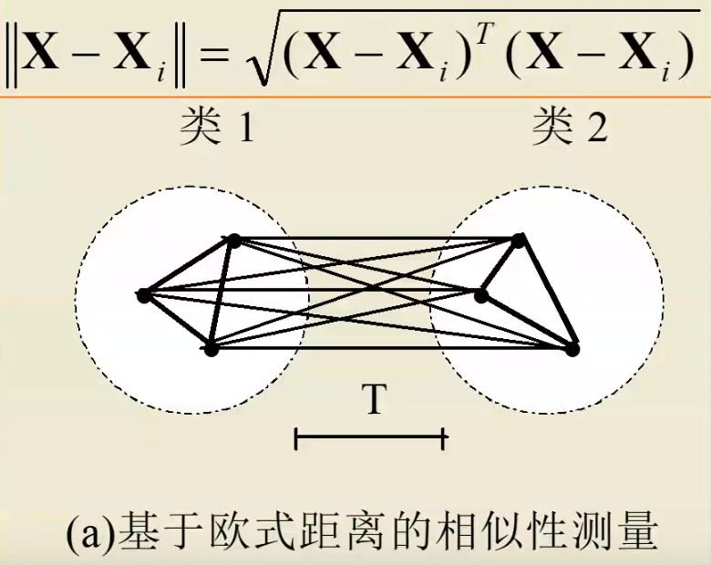

# SOM

> 来源于知乎，B 站等等
> [带你了解人工智能的个人空间](https://space.bilibili.com/529985682/video) 34-41 讲
>
> [SELF ORGANISING MAPS: INTRODUCTION - YouTube][you]
>
> 1. INTRODUCTION 比较快速地介绍，有一个同样内容同一个人但是介绍的特别特别详细的视频 [Self-Organizing Maps Intuition Video_哔哩哔哩][web]
> 2. HYPERPARAMETER TUNING 如何调参（学习率，sigma 超参数），似乎使用了别的库（梯度下降调参？）
> 3. ANOMALY DETECTION 一个应用实例，对物联网设备软件的异常监测，但是我没有看，它的代码链接放在了后面的实例学习里。
>
> [SOM （自组织映射神经网络）—— 理论篇][zhihu]
>
> [you]:https://www.youtube.com/watch?v=0qtvb_Nx2tA&list=PLE50-dh6JzC7GirZIpfA7ngLwdn2m4Fel
> [web]:https://www.bilibili.com/video/BV1UZ4y1x7di
> [zhihu]:https://zhuanlan.zhihu.com/p/73534694

## 1 竞争学习基本概念

自组织神经网络有许多种，除了 SOM 以外，还有学习向量量化 LVQ(Learning Vector Quantization) 神经网络，对偶传播神经网络模型 (Counter Propagation Network,CPN)，自适应共振网络 (Adaptive Resonance Theory,ART)。

他们的共同特点是都具有输入层和竞争层。
输入层起到观察作用，竞争层进行归类。

### 1.1 分类与聚类

1. 分类——分类是在 类别知识等导师信号/**标签** 的指导下，将待识别的输入模式分配到各自的模式类中去。
2. 聚类——无 导师指导/**标签** 的分类称为聚类，聚类的目的是将相似的模式样本划归一类，而将不相似的分离开。

我们无法利用先验知识对数据进行分类/贴标签，只能利用数据之间的**相关性**进行聚类。

### 1.2 数据相关性

如何测量数据之间的相似性呢？

1. **欧式距离法**：利用输入向量之间的距离。
   
2. **余弦法**：向量越接近，夹角越小
   
   余弦法适合**所有输入向量的长度相同**或者样本特征只与向量方向相关，与长短关系不大。

### 1.3 侧抑制与竞争

> 视网膜由许多小的光敏神经细胞组成。科学家们发现，当刺激某个细胞得到较大反应时，再刺激它邻近的细胞，前者的反应会减弱，这种现象被称之为“侧抑制”。
> > 
> > 周围亮的背景抑制了中间灰色区域，使得中间灰色区域显得更暗。
>
> 侧抑制有利于视觉从背景中分出对象，尤其在看物体的边角和轮廓时会提高视敏度，使对比的差异增强。
> 在听觉系统中，耳蜗神经纤维的侧抑制可以加强对音高的辨认。
> 在皮肤上，侧抑制有助于触点的定位。

兴奋程度最高的神经细胞对周围神经细胞的抑制作用也越强，其结果使其周围神经细胞兴奋度减弱，从而该神经细胞更加“鹤立鸡群”，成为这次竞争的“胜者，而其它神经细胞在竞争中失败。

### 1.4 向量归一化

让向量变成方向不变，长度为 1 的单位向量。
单位向量在进行比较时，只需要比较向量的夹角，即可比较相似性。


### 1.5 著名的竞争学习策略：胜者为王

对于输入层接收的某一个输入 X，竞争层的所有神经元均有输出响应，其中**响应值最大的神经元**称为在竞争中获胜的神经元。
胜者为王采用了最强的抑制作用，即竞争获胜者“唯我独兴”，其它神经元的输出一律被抑制为 0 ，故称为 Winner Take All。

1. 向量归一化
2. 寻找获胜神经元：竞争层的所有神经元对应的**权向量**均与当前**输入模式向量**进行相似性比较，并将最相似的权向量判为竞争获胜神经元，记为 $j^*$。
   
   可以证明向量归一化后，寻找最小欧氏距离只需要寻找最大**点积**。
   
3. 网络输出与权值调整
   只有获胜神经元输出为 1，其他神经元输出为 0. 获胜神经元可以调整自己的权值。
   

> 演变过程：[ANN 第 36 讲：通过两个例子体会胜者为王权值调整的几何意义](https://www.bilibili.com/video/BV1ke411p7ga) 讲解的很详细。

#### 1.5.1 学习率

学习率是一个**随着时间不断下降**的函数，（原视频的老师）叫做模拟退火函数。

> 模拟退火算法 (Simulated Annealing，SA) 最早的思想是由 N. Metropolis 等人于 1953 年提出。1983 年，S. Kirkpatrick 等成功地将退火思想引入到组合优化领域。它是基于 Monte-Carlo 迭代求解策略的一种随机寻优算法，其出发点是基于物理中固体物质的退火过程与一般组合优化问题之间的相似性。模拟退火算法从某一较高初温出发，伴随温度参数的不断下降，结合概率突跳特性在解空间中随机寻找目标函数的全局最优解，即在局部最优解能概率性地跳出并最终趋于全局最优。模拟退火算法是一种通用的优化算法，理论上算法具有概率的全局优化性能，目前已在工程中得到了广泛应用，诸如 VLSI、生产调度、控制工程、机器学习、神经网络、信号处理等领域。
>
> 模拟退火算法是通过赋予搜索过程一种时变且最终趋于零的概率突跳性，从而可有效避免陷入局部极小并最终趋于全局最优的串行结构的优化算法。

如果学习率保持不变，则进行到最后会不断震荡。
**MyOpinion:** 使用退火函数的优势在于，其最终停止的地方更加合理，想象一个盒子装着沙子，通过摇晃/拍打盒子让沙子震荡。刚开始拍打力气大，沙子震荡剧烈，慢慢地减小力度，则沙子会越来越小地调整。如果减小力度的速度比较合理，那么可以理解，沙子最终会完全平坦。

#### 1.5.2 几何意义


黑色带`*`的线为互相竞争的结点，不带`*`的线为一个样本。

获胜结点权值向量加了**红色的变化向量**，方向更加接近输入向量，同时长度不再为 1. 所以需要重新进行归一化。

## 2 SOM 概念

!!! note "视频介绍"
    <video id="video" controls="" preload="none" width=100%>
          <source id="mp4" src="assets/SOM/SELF%20ORGANISING%20MAPS_%20INTRODUCTION.mp4" type="video/mp4">
    </videos>

    [SELF ORGANISING MAPS_ INTRODUCTION.mp4](assets/SOM/SELF%20ORGANISING%20MAPS_%20INTRODUCTION.mp4)
    这个视频是一个 6 分钟的简单介绍。前面给出的 [网页][you] 中包括更详细内容。

1981 年芬兰 Helsink 大学的 T.Kohonen 教授提出一种自组织特征映射网，简称 SOM 网，又称 Kohonen 网。（也有名称是 (Self-organizing feature map, SOFM）

Kohonen 认为：一个神经网络接受外界输入模式时，将会分为不同的对应区域，各区域对输入模式具有不同的响应特征，而且这个过程是自动完成的。自组织特征映射正是根据这一看法提出来的，其特点与人脑的自组织特性相类似。

**生物学基础：**
生物学研究的事实表明，在人脑的感觉通道上，神经元的组织原理是**有序排列**。因此当人脑通过感官接受外界的特定时空信息时，大脑皮层的**特定区域**兴奋，而且类似的外界信息在对应区域是**连续映象**的（图像形状接近，兴奋的神经元位置也接近）。
对于某一图形或某一频率的特定兴奋过程，神经元的有序排列以及对外界信息的连续映象是自组织特征映射网中竞争机制的生物学基础。


> - Matlab 的神经网络工具箱里面有：[Cluster Data with a Self-Organizing Map](https://www.mathworks.com/help/deeplearning/gs/cluster-data-with-a-self-organizing-map.html;jsessionid=dc39e0187ccc2896a93a64c6cdc8)
> - Wikipedia 的解释也很不错：[Self-organizing map](https://en.wikipedia.org/wiki/Self-organizing_map)

自组织映射 (Self-organizing map, SOM) 通过学习输入空间中的数据，生成一个低维（一般是二维）、离散的映射 (Map)，从某种程度上也可看成一种降维算法。（高维空间临近的点在映射的低维空间仍然临近）

SOM 是一种无监督的人工神经网络。
不同于一般神经网络基于**损失函数**的反向传递来训练（错误相关的学习，涉及到反向传播和梯度下降。），它运用**竞争学习** (competitive learning) 策略，依靠神经元之间**互相竞争**逐步优化网络。且使用**近邻关系函数** (neighborhood function) 来**维持输入空间的拓扑结构**。
> 维持输入空间的拓扑结构意味着：二维映射包含了数据点之间的相对距离。输入空间（高维）中相邻的样本会被映射到相邻的输出神经元。

在竞争性学习中，各个节点会相互竞争响应输入数据子集的权利。训练数据通常没有标签，映射会学习根据相似度来区分各个特征。

> SOM 是一种用于**特征检测**的无监督学习神经网络。它模拟人脑中处于不同区域的神经细胞分工不同的特点，即不同区域具有不同的响应特征，而且这一过程是自动完成的。SOM 用于生成训练样本的低维空间，可以将高维数据间复杂的非线性统计关系转化为简单的几何关系，且以低维的方式展现，因此通常在降维问题中会使用它。


- 非常适合高维数据的可视化，能够维持输入空间的拓扑结构
- 具有很高的泛化能力，它甚至能识别之前从没遇过的输入样本

## 3 SOM 原理

下图展示了 SOM 的训练过程。
紫色区域表示训练数据的分布状况，白色网格表示从该分布中提取的当前训练数据。
首先，SOM 节点位于数据空间的任意位置。最接近训练数据的节点（黄色高亮部分）会被选中。
它和网格中的邻近节点一样，朝训练数据移动。在多次迭代之后，网格倾向于近似该种数据分布（下图最右）。


**有两种方式来解释 SOM：**

1. 解释一：在训练阶段，整个邻域中节点的权重往相同的方向移动。因此，SOM 形成语义映射，其中相似的样本被映射得彼此靠近，不同的样本被分隔开。这可以通过 U-Matrix 来可视化
2. 解释二：另一种方法是将神经元权重视为输入空间的指针。它们形成对训练样本分布的离散近似。更多的神经元指向的区域，训练样本浓度较高；而较少神经元指向的区域，样本浓度较低。


当我们将训练数据输入到网络中时，会计算出所有权重向量的欧几里德距离。
权重向量与输入最相似的神经元称为**最佳匹配单元（BMU）**。BMU 的权重和 SOM 网格中靠近它的神经元会朝着输入矢量的方向调整。
一旦确定了 BMU，下一步就是计算其它哪些节点在 BMU 的邻域内。

SOM 是一个单层的神经网络。
神经元采用竞争的方式激活，每个神经元有一个权值向量 $\omega_i$，输入向量 $x$ 会激活与之**最接近**的神经元，这个神经元叫做获胜神经元 (winner)。

所有的神经元组织成一个网格，网格可以是六边形、四边形……，甚至是链状、圆圈……
这个随便自己设定。
网络的结构通常取决于输入的数据在空间中的分布。
SOM 的作用是将这个网格铺满数据存在的空间。
铺满是这样达成的：

1. 被激活的 winner 的权值会向输入靠拢；
2. winner 周围的神经元会向 winner 靠拢。

> 用梯度下降的方式更新 winner 权重，winner 周围的点距离越近更新的权重越大。

最终的效果就是对数据进行了聚类，每个神经元代表一类。
这一类所包含的数据，就是能够使它竞争获胜的那些数据。

**组成部分：**

- 初始化：将所有连接权重初始化为随机值。
- 竞争：输出节点相互竞争激活的机会，每次只有一个被激活。激活的神经元就叫做 “赢家通吃” 神经元。由于存在这种竞争，神经元被迫自我组织，形成自组织映射（SOM）。
- 合作：在竞争中获胜的神经元会决定活跃神经元拓扑邻域的空间位置，为相邻神经元之间的合作提供了基础。
- 适应：活跃神经元会降低**判别函数**的个体值，通过适当调整相关连接权重来完成（和输入模式相关）。
   这样，获胜神经元对随后应用同样输入模式的响应就会得到增强。判别函数定义为每个神经元 j 的输入向量 x 和权重向量 wj 之间的平方欧几里德距离：
   $d_j(x)=\sum_{i=1}^{D}(x_i-w_{ji})^2$

## 4 网络结构


SOM 的网络结构有 2 层：输入层、输出层 （也叫竞争层）


1. **输入层**神经元的数量是由**输入向量的维度**决定的，一个神经元对应一个特征。
2. SOM 网络结构的区别主要在**竞争层**：可以有 1 维、2 维 （最常见的）
   > 竞争层也可以有更高的维度。不过出于可视化的目的，高维竞争层用的比较少
   > 
   > 

二维平面有 2 种平面结构：


1. Rectangular（矩形的）
2. Hexagonal（六角形的）

> 这个是怎么实现的？可能是体现在神经元存储结构上。比如每个神经元存储 1 个多维向量，而用另一个向量存储这些神经元，也就是多维数组。
> 假如说是 2 维数组，则一个维度是各个神经元，另一个维度是神经元的信息。这种情况下神经元一维排列，因为这个维度是线性的。
> （仅仅是看到某些代码后的理解，也可能通过其他方式实现）
> 实际上只需要制定神经元之间距离的计算，就可以制定他们的拓扑结构。（这个层面上看，要给神经元设定坐标信息，soga）
>
> 如果使用现成的库 minisom 之类的话就不用关心这些细节。

竞争层 SOM 神经元的**数量**决定了最终模型的粒度与规模；这对最终模型的准确性与泛化能力影响很大。

一条经验公式：（N：训练样本的个数）
$竞争层最少节点数量= 5\sqrt{N}$
这个公式在另一个视频里也得到了印证，据说在一个 paper 里面有证明。（谁知道呢- - 实际使用的时候可以自己多试几个，结点数目与邻域半径这两个超参数要互相配合）


如果是正方形输出层，边长等于 **竞争层节点数再开一次根号**，并向上取整就行（`math.ceil`函数）。
`x,y=sqrt（竞争层的节点数量）`

## 5 训练 SOM 的步骤


1. 初始化每个节点的权重。
   权重设置为**标准化**小型随机值。
   > 与其他神经网络相同，需要将 Weighs 初始化为很小的随机数
2. 从训练集中随机选择一个向量$x_i$并呈现给网格。
3. 利用欧几里德距离选中最佳匹配单元（BMU）（winning neuron）
   （检查每个节点来计算**哪一个的权重最像输入向量**。）
   1. 遍历竞争层中每一个节点：计算 Xi 与节点之间的相似度 （通常使用每个节点的权重与当前输入向量之间的**欧几里德距离**来计算）（根据前面的推导，向量归一化后可以直接比较**点积**）
   2. 选取距离最小的节点作为优胜节点 (winner node)，有的时也叫 BMU(best matching unit)

4. 计算 BMU 邻域的半径。在半径范围内找到的节点则认为处于 BMU 邻域内。
   根据**邻域半径** σ(sigma) 确定**优胜邻域**将包含的节点；
   并通过 neighborhood function 计算它们各自更新的幅度。
5. 调整在步骤 4 中发现的节点的权重，让它们更像输入向量。节点和 BMU 越近，权重调整的越多。
   > 可以对学习率$\eta$进行监测，当其降低到 0 或设定的最小值时就结束本轮调整。
6. 返回步骤 2 重复进行，迭代 N 次。


### 5.1 初始化中的数据处理

#### 5.1.1 输入层初始化

由于 SOM 是基于距离的算法，所以输入矩阵 X 中的类别型特征必须进行 One-Hot 编码。

> 可以考虑进行**标准化** （均值为 0，标准差为 1)；这样有助于使每个特征对于计算相似度的贡献相同。
> 对于输入数据的处理，见到有很多归一化的。
> 具体再多思考思考怎么做吧~（之前视频讲向量变成单位向量，只需要比较向量的夹角，但是觉得有点无法理解，`(1,1),(2,2)`会变的无法区分这样子）

更新：看了一些资料（详见 [[数据预处理]]），感觉对于求解旅行商问题，输入的坐标信息可以看做**两个特征**：x 坐标与 y 坐标，分别对于 x 与 y 进行归一化（不使用标准化是因为输入坐标是有明显界限的，并且不会有奇奇怪怪的极端坐标）。
至于输入向量归一化应该是不可以的，因为输入向量归一化只适用于不关心向量长度的情况，但是坐标信息`(1,1),(0.5,0.5)`是不一样的……

#### 5.1.2 输出层初始化

三种初始化方法：

- Random initialization：适用于对输入数据有很少或没有任何先验知识
- Initialization using initial samples：优点是初始时刻，网络节点就与输入数据的拓扑结构很相似
- Linear initialization (PCA)：让网络向输入数据能力最大的方向延伸

> 原作者使用 miniSom 举例，
> 其实在 miniSom 创建模型后，就已经进行 Random initialization 了；som.`random_weights_init()` 其实是 "Initialization using initial samples"

三者对比的话：
Principal component initialization is preferable (in dimension one) if the principal curve approximating the dataset can be univalently and linearly projected on the first principal component (quasilinear sets). For nonlinear datasets, however, random initiation performs better.
另外，很多论文做过实验，PCA Initialization 并不是在任何情况下都优于 random initiation，取决于输入数据本身的性质。推荐调参的时候，两种都试试吧～

[这里](https://blog.csdn.net/antkillerfarm/article/details/80797389) 提到，通常有两种初始化 weight vector 的方法：

1. 用小的随机值初始化。
2. 从最大的两个主特征向量上进行采样。显然，第 2 种训练起来要快的多。因为它已经是 SOM weights 的一个很好的近似了。<!-- TODO: 这里看不懂啊！！！ -->

## 6 公式与算法

> **ATTENTION:** 本部分各公式表达符号不尽相同。

$$
w_{ij}(t+1)=w_{ij}(t)+\eta[t,N](x_i^p-w_{ij}(t))
$$
$\eta(t,N)$中$t$为训练轮数，$N$为邻域内第$j$个神经元与获胜神经元$j^*$之间的拓扑距离。
两者越大，$\eta$越小，但具体表达式可以自己构造。
> 
> 感觉**实际上**这个就是学习率（退火函数）与邻域函数（距离越远影响越小）的乘积，
> 这里列出了学习率三种可能的衰减情况（或许需要自己实践哪个更好用一些？），而邻域函数使用指数函数衰减。
> 下面的同样思路，只不过学习率使用负指数函数，邻域函数使用高斯函数。


图片来源 [B 站视频][web]，讲得非常详细！
lateral distance 计算方法似乎也是欧几里德距离。
不过这里应该指的是神经元之间的拓扑距离吧，图中使用`w`是神经元的特征向量，计算出的是相似度而不是拓扑距离，我感觉回来再仔细看看他那个代码。<!-- TODO: 啊啊啊 -->

> **下面是看到的其他形式的公式，有点不一样：**
> $\alpha$是学习率
> $\sigma$是邻域函数，两个神经元在网络上离得越近值越大，在邻域函数的控制下，网格尽量保持着拓扑结构，同时被输入数据拉扯着充满输入数据分布空间。
> $$
> \Delta\omega_{winner}=\alpha\cdot(x-\omega_{winner}) \\
> \Delta\omega_i=\alpha\cdot\sigma(\omega_i,\omega_{winner})\cdot(\omega_{winner}-\omega_i)
> $$
> > 本质上这个公式和上方图片是一样的，只不过这里可以清晰地看到，我们设定邻域函数时，在对胜者本身更新时为 1，所以可以看到都是负指数函数（高斯函数），神经元之间的距离作为指数的分子（获胜神经元对自己距离为 0）

### 6.1 Neighborhood Function

> 前面讲的赢家通吃，只有胜者本身才能更改权值不同，在 SOM 中赢家附近的结点也会由近及远受到影响。
> 这样带来的结果则是输出网络可以保留原来的结构，原来挨着的神经元在调整位置过后还挨着，这样比较接近生物神经元的特定响应连续映像的特性。
> 
> 左侧结点顺序被打乱为 14253，右侧仍然保留了 12345.

neighborhood 函数用来确定优胜节点对其近邻节点的**影响强弱**，即优胜邻域中每个节点的更新幅度。
最常见的选择是**高斯高斯函数**，它可以表征优胜邻域内，影响强弱与距离的关系。
> 高斯函数一般形式：
> $$
> f(x)=ae^{-\frac{(x-b)^2}{2c^2}}
> $$

[SOM （自组织映射神经网络）—— 理论篇 - 知乎][zhihu] 这里讲的**优胜邻域内节点更新程度可视化**看的不太懂，就没有搬运过来。大概意思是说对于结点的更新程度往外递减。还有一部分是采用 Bubble 近邻函数来近似高斯函数，减小计算量。

> One worth mentioning is a bubble neighborhood, that updates the neurons that are within a radius of the winner (based on a discrete Kronecker delta function （即单位脉冲序列）), which is the simplest neighborhood function possible.
> [Using Self-Organizing Maps to solve the Traveling Salesman Problem](https://diego.codes/post/som-tsp/#orgc3d432d)

在 [BV1FC4y1s7ni](www.bilibili.com/video/BV1FC4y1s7ni) 视频里面，讲的 SOM 通过设定一个阈值，将大于阈值的所有节点都记为优胜结点，实质上与 neighborhood function 为一个道理，因为挨得近的数值也就越接近。
同时所有节点都记为优胜结点还意味着所有节点权值更新幅度相同，这点比较类似 [之前][zhihu] 采用 Bubble 函数近似，优胜结点以及邻域内的所有节点更新幅度是相同的。
这样做的好处除了减小计算量以外，还可以比较明显地划分类别。（不知道我理解的对不对）

> [BV1jK4y187Ea](www.bilibili.com/video/BV1jK4y187Ea) 所述的理论中，影响强弱与距离的关系则如图所示。
> a 中两个函数合并为 b，随着距离增加影响逐渐减小甚至排斥（有点像**侧抑制**），简化形式则为 c，d
> 
> 

### 6.2 学习率 α、邻域范围 σ 随时间衰减

衰减函数 decay func “最常用”（原文说的）的的是：$\frac{1}{1+\frac{t}{T}}$
`t` 代表当前迭代次数
`T` = 总迭代次数 / 2


> 公式正文所列的公式中，衰减函数则是通过指数函数：$e^{-\frac{t}{\tau}}$
> 其中$\tau$是超参数，在$\alpha$以及$\sigma$的衰减中不相同。
>
> 还看到一个形式为：
> $$
> \alpha_0(1-\frac{t}{T})
> $$
> 它们的共同点都是从 1 逐渐接近 0.

优胜邻域/邻域半径开始定的很大，但大小随着训练次数增加不断收缩至 0.

## 7 SOM 应用

SOM 通常用在**可视化**中。比如下图，世界各国贫困数据的可视化。生活质量较高的国家聚集在左上方，而贫困最严重的国家聚集在右下方。


- 数据压缩
- 语音识别
- 分离音源
- 欺诈检测


由于 SOM 可以将高维数据映射到 2 维数据，所以它可以适用于几乎所有领域，将复杂的数据进行简化归类，并且通过欧几里何距离形成可视化图像。

- 保序映射：将输入空间的样本模式类有序地映射在输出层上。（原来挨得近的映射后还挨得近）
- 数据压缩：高维空间的样本在保持拓扑结构不变的情况下投影到低维空间。
- 特征抽取：高维空间的向量的特征在低维特征空间更加清晰地表达

## 8 开源实现以及可以使用的工具


部分可视化所用工具见 [这里](#可视化)

### 8.1 miniSom 库

[JustGlowing/minisom: MiniSom is a minimalistic implementation of the Self Organizing Maps](https://github.com/JustGlowing/minisom)

**创建网络：** 创建时就会随机初始化网络权重

`som = minisom.MiniSom(size,size,Input_size, sigma=sig,learning_rate=learning_rate, neighborhood_function='gaussian')`

`som.random_weights_init(X_train)`：随机选取样本进行初始化
`som.pca_weights_init(X_train)`：PCA 初始化

三种初始化方式，选一种即可

**两种训练方式：**

`som.train_batch(X_train, max_iter, verbose=False)`：逐个样本进行迭代
`som.train_random(X_train, max_iter, verbose=False)`：随机选样本进行迭代

**训练好的模型：**

`som.get_weights()`： Returns the weights of the neural network
`som.distance_map()`：Returns the distance map of the weights
`som.activate(X)`： Returns the activation map to x 值越小的神经元，表示与输入样本 越匹配
`som.quantization(X)`：Assigns a code book 给定一个输入样本，找出该样本的优胜节点，然后返回该神经元的权值向量 （每个元素对应一个输入单元）
`som.winner(X)`： 给定一个输入样本，找出该样本的优胜节点 格式：输出平面中的位置
`som.win_map(X)`：将各个样本，映射到平面中对应的位置返回一个 `dict{ position: samples_list }`
`som.activation_response(X)`： 返回输出平面中，各个神经元成为 winner 的次数 格式为 1 个二维矩阵
`quantization_error（量化误差）`： 输入样本 与 对应的 winner 神经元的 weight 之间的 平方根

## 9 可视化

SOM 本质是在逼近输入数据的概率密度，以下几种工具能非常好的可视化训练好的 SOM 网络

- U-Matrix
- Component Plane

### 9.1 U-Matrix(unified Distance matrix)

U-matrix 包含每个节点与它的邻居节点 （在输入空间） 的欧式距离：

- 在矩阵中较小的值表示该节点与其邻近节点在输入空间靠得近
- 在矩阵中较大的值表示该节点与其邻近节点在输出空间离得远

因此，U-matrix 可以看作输入空间中数据点概率密度在二维平面上的映射。


通常使用 Heatmap 来可视化 U-matrix，且用颜色编码 （数值越大，颜色越深）
在图上，浅色区域可以理解为 簇的簇心，深色区域可以理解为分隔边界

```matlab
# MINISOM API
som.distance_map()
```

### 9.2 Component Plane

通过 component plane，能够可视化相关变量或者额外变量的分布。


Component plane 可以理解成 SOM 网络的切片版本。每一个 component plane 包含了一个输入特征的相对分布。

在这种图中，深色表示相对小的取值，浅色表示相对大的取值。

通过比较 component planes，我们可以看出两个 component 的相关信。如果看上去类似，那么它们强相关

## 10 实例学习

[FlorisHoogenboom/som-anomaly-detector: Implementation of Kohonen SOM for anomaly detection purposes.](https://github.com/FlorisHoogenboom/som-anomaly-detector)

[第 40 课：自组织特征映射网络 (SOFM)——剖析几个应用案例（上）](https://www.bilibili.com/video/BV1n54y1X7by)

[SOM（自组织映射神经网络）——案例篇 - 知乎](https://zhuanlan.zhihu.com/p/73930638)
是用 python 的 miniSom 库实现的示例。<!-- TODO: 这个再仔细研究研究！！ -->

另外 [SOM 模型 - 简书](https://www.jianshu.com/p/d49b1c3b0e0a) 也讲了如何利用 MiniSom 创建一个简单的 SOM <!-- TODO: 这个暂时打不开了，回来看看 -->

论文示例:

- [基于附加敏感参数SOM神经网络的自动聚类系统的研究 - 中国知网](https://kns.cnki.net/kcms/detail/detail.aspx?dbcode=CMFD&dbname=CMFD2010&filename=2010089064.nh&uniplatform=NZKPT&v=j_4oOYHlEv_wpcvKaADzvqPuGtDH1ocaQz4gxbqztpSJvbVlu4wr9onoENX4zwO2)
- [一种改进的三层SOM入侵检测方法 - 中国知网](https://kns.cnki.net/kcms/detail/detail.aspx?dbcode=CJFD&dbname=CJFDLAST2019&filename=XDDJ201915018&uniplatform=NZKPT&v=s01qpJWzCmZPcVj5MPZ3PPNToj_lztprNb6qutKJVljvZXs1HaSq15W2TRYZR4eA)
