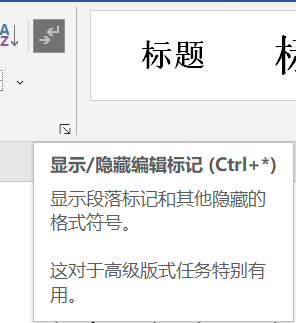
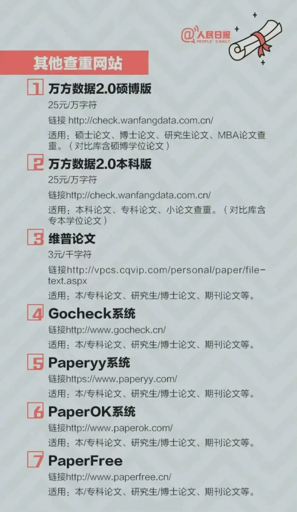

# 文献阅读与综述

[toc]

## 1 研究步骤

毕业设计/研究任何一个新的东西:
从一篇综述出发 (review of xxx) --> 精读了解整体发展情况以及主要方面 --> 细化至各个方向分别了解 (看 abstract 确定是否与自己感兴趣内容相关, 不用全部精读)

文献分类:

1. 按内容分类: 不同方面
2. 按时间分类: 发展历史

文献批评 critic: 客观地分析优缺点, 不要主观

文献来源:

1. 各个论文引擎(?), 例如 SCI IEEE, 在图书馆(?)网站上 能找到
2. 百度学术, Google Scholar

- 小论文: 期刊, 会议, 言简意赅
- 大论文: 学位论文, 通常很详细, 如果有不懂的问题可以试着找找相关的大论文

文献管理软件

## 2 科技论文写作

查重率<30%, 一般<10%. 使用知网查重库.

- 学术性论文: 学术期刊论文, 学术会议论文
- 技术性论文: 技术文档?
- 学位论文: 学士、硕士、博士

科技论文的特点:

- 科学性
- 创造性: 慎用 "首创", "首次提出", "众所周知"等词语, 可以使用 "提出了"
- 学术性、理论性: 做一件事情, 得到什么结果, 要进行分析
- 规范性、可读性

把事情肝完后, 材料组织和整理的过程. 可以用思维导图之类的.

开口表/三线表
粗1磅,细

## 3 论文查重

