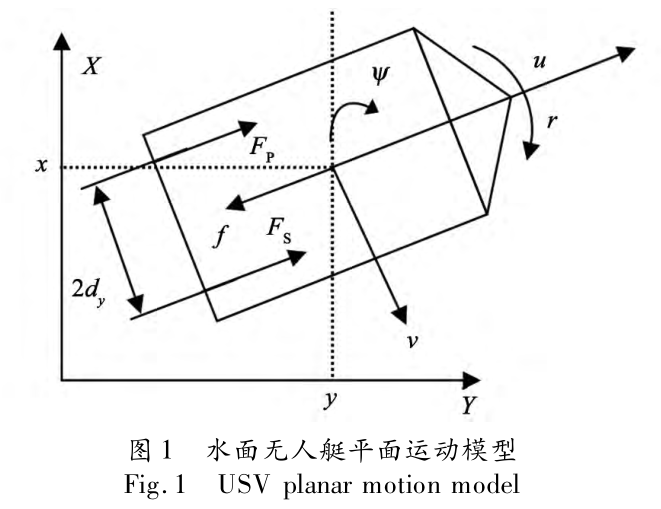
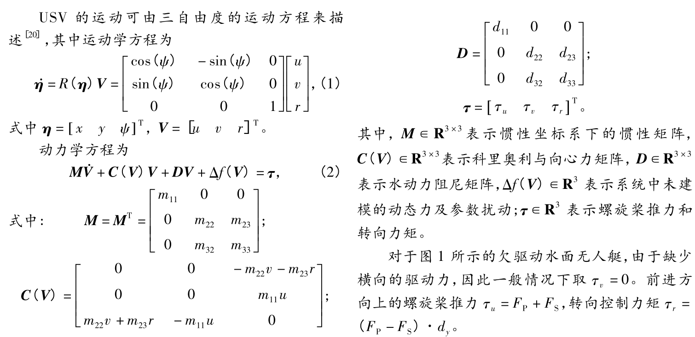
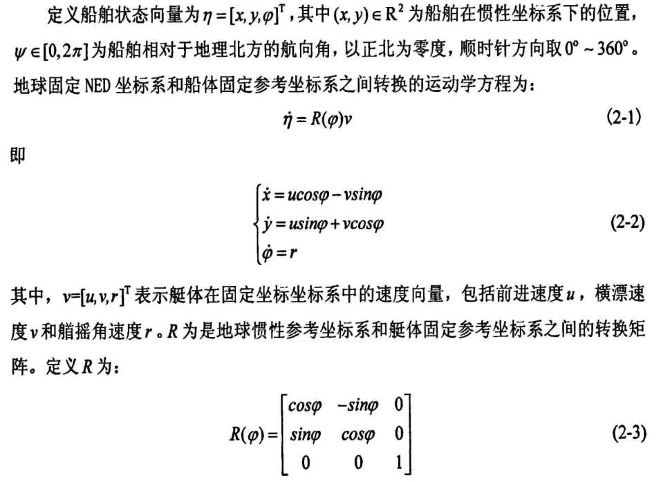
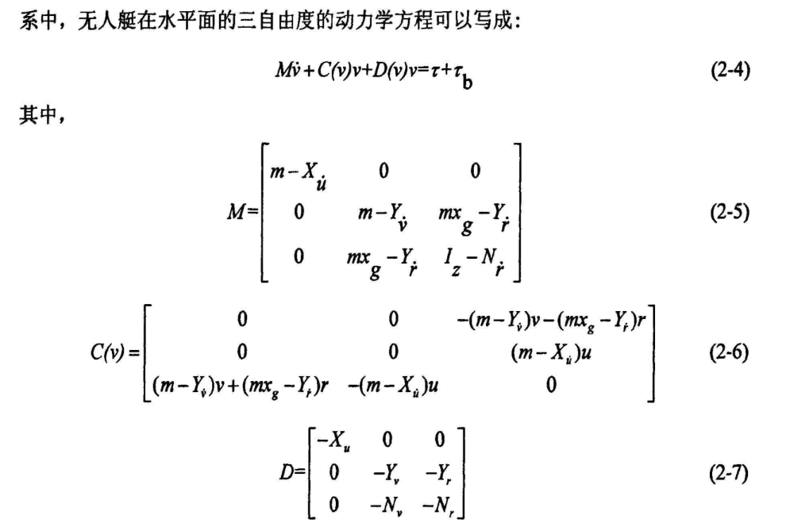
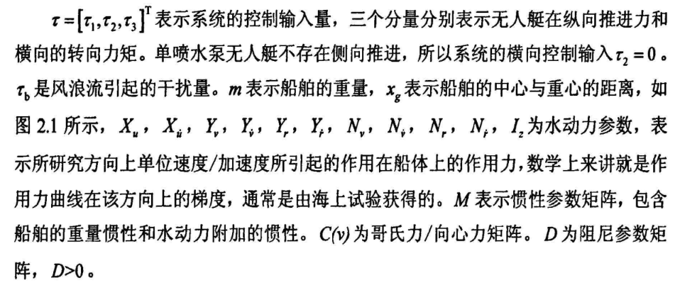
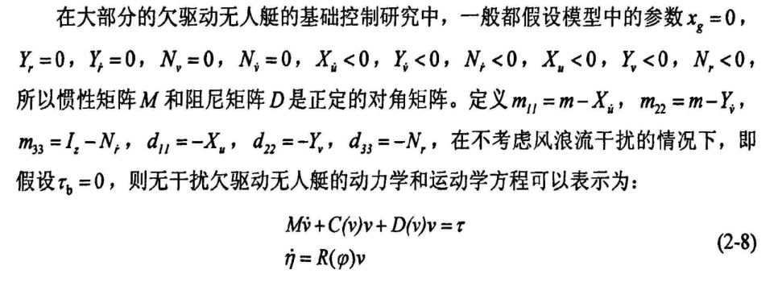
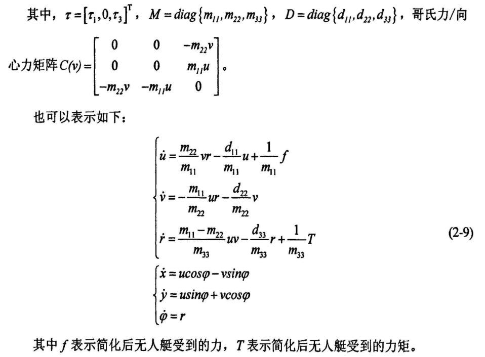

# 无人艇

> [欠驱动水面无人艇的航迹跟踪控制研究 - 豆丁网](https://www.docin.com/p-1017726858.html)
> [基于自抗扰控制的水面无人艇路径跟踪控制器 王常顺](https://kns.cnki.net/KCMS/detail/detail.aspx?dbcode=CJFD&dbname=CJFDLAST2016&filename=SDGY201604009&v=)

## 1 坐标表示

- **NED（North-East-Down）坐标系** 以地球表面上的一点作为原点，坐标系的Ⅹ 轴指向北向，Y 轴指向东向，并且Ⅹ轴和 Y 轴构成的平面与地球表面相切，Z 轴指向地心，它是地理参考坐标系的一种。对于无人艇而言，可以认为该坐标系是一个惯性坐标系。
- **艇体固定坐标系** 以艇体上的重心为原点，x 轴的正向表示船艏 (shou), y 轴的正向表示船的右舷，oz 轴正向指向地心.

无人艇在地球固定 NED 坐标系中的水平面运动示意图如上，几个需要注意的地方:

1. `(x,y)`为无人艇在 NED 坐标系中的位置. 注意这里 XY 坐标轴位置和平时的不太一样
2. $\Psi$ 为无人艇的艏摇角（船舶相对于地理北方的航向角，以正北为零度，顺时针取）。艏摇角速度 $r=\dot{\Psi}$.
3. 前进速度 u, 横漂速度 v
4. 该平面运动模型中无人艇的运动控制来自于左右两个推力$F_p,F_S$
    1. 前进方向螺旋桨推力 $\tau_u=F_p+F_s$
    2. 转向控制力矩 $(F_p-F_s) d_y$.
        $d_y$ 是图中螺旋桨推力作用点到质心轴线(转轴)的垂直距离.
        注意这里$F_p\cdot d_y$ 的方向是顺着 $\Psi$ 增加的角度的.
5. 垂荡（heave）、横荡（sway）、纵荡（surge）、纵摇（pitch）、横摇（roll）、艏摇（yaw）--- 航行的船舶可产生的 6 个自由度的运动分量.

> 

## 2 运动学方程

??? note "关于 $\psi$ 的单位 "
    $\psi$ 的单位是 $rad/s$, 如果不确定，仿真测试一下就知道了.

    === "输入输出信号"
        
        $\tau_r$ 持续时间为 20s, 幅值为 1, 累计得到的结果是 3.4979
    === "轨迹"
        
        `atan`反正切（以弧度为单位）
        `atan((2.494-1.33)/(4.758-1.595))+pi` 计算得到 `3.4942`, 和上面信号显示的相吻合
        也就是大概 200°
