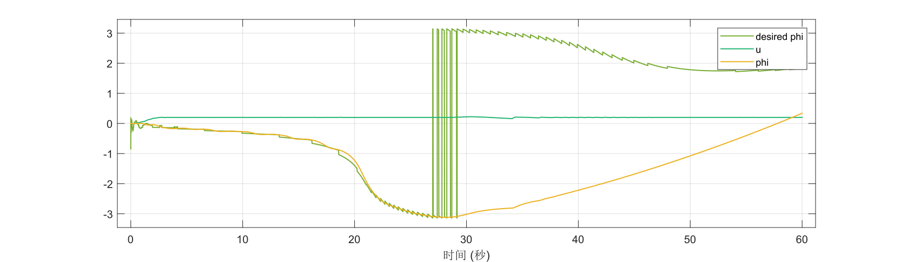
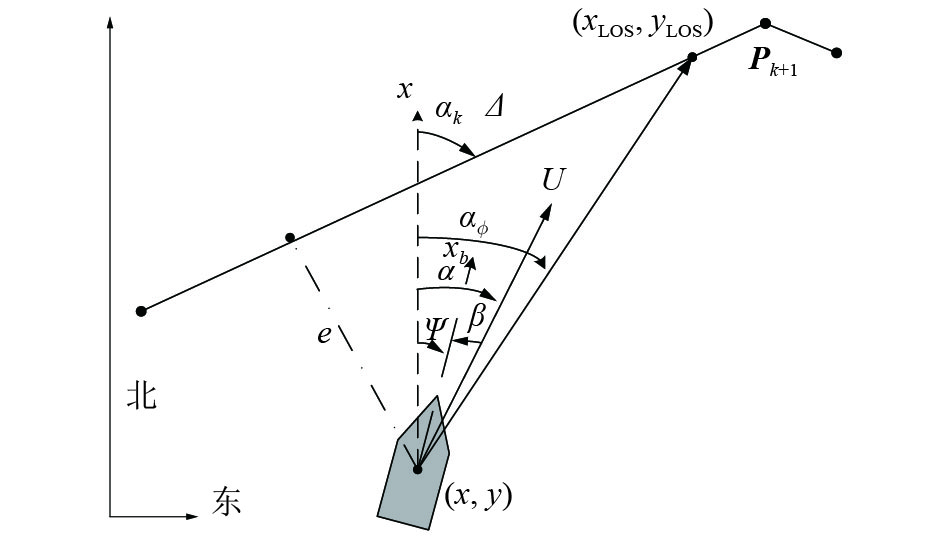
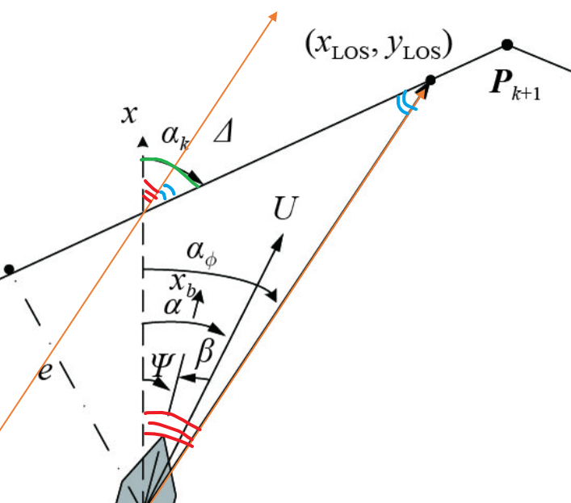
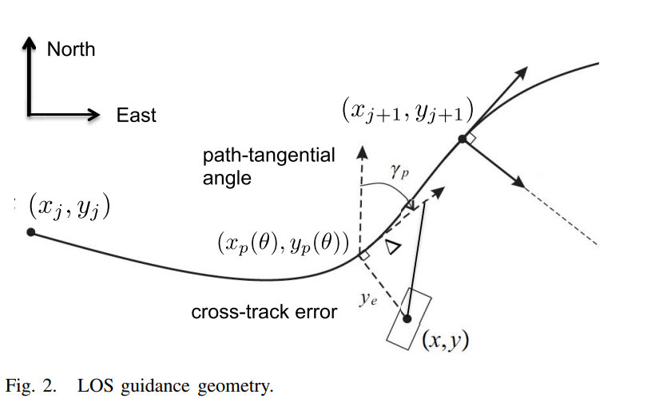
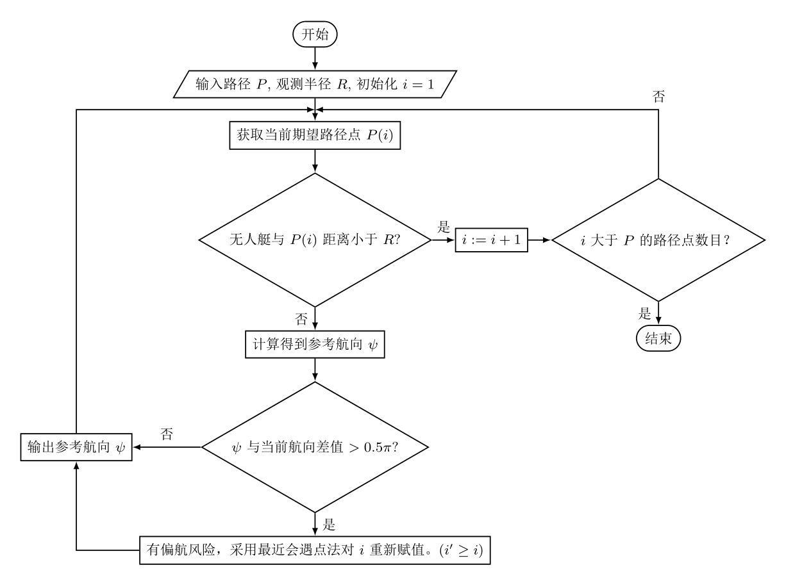

# 路径跟踪

**轨迹跟踪**是考虑时间信息（即某时刻到达某点），而**路径跟踪**不用考虑时间信息, **无人艇与路径上的最近距离，作为路径跟踪误差**.

- 样条法平滑路径
- 最近会遇点法跟踪

## 1 样条法

样条函数（spline function）是某种意义上的分段函数（piecewise polynomial function）。
样条函数是由一些具有某些连续性条件得子空间上得分段多项式构成。给定 n+1 个点$t_0,t_1,\cdots,t_n$ 并满足$t_0<t_1<\cdots<t_n$, 这些点称为结点. 又假如指定整数$k\ge0$, 具有结点$t_0,t_1,\cdots,t_n$ 的一个$k$次样条函数是指满足下列条件的函数$S$:

1. 在每个区间$[t_{i-1},t_i]$上，S 是一个次数$\le k$ 的多项式
2. 在$t_0,t_n$ 上 S 有$k-1$阶连续导数

### 1.1 Spline 原理

!!! cite "其他参考资料"
     [轨迹生成--三次样条插值 - 知乎](https://zhuanlan.zhihu.com/p/80756122)
     [一文读懂回归样条（regression splines），附 Python 代码 - 知乎](https://zhuanlan.zhihu.com/p/34825299)
     [样条函数_MTandHJ 的博客-CSDN 博客_样条函数](https://blog.csdn.net/MTandHJ/article/details/101528966)
     [改进A星算法（五）贝塞尔曲线平滑_哔哩哔哩_bilibili](https://www.bilibili.com/video/BV1jS4y1K7qG?spm_id_from=333.1007.top_right_bar_window_custom_collection.content.click)

> [路径规划与轨迹跟踪系列算法学习_第 8 讲_B 样条曲线法_哔哩哔哩_bilibili](https://www.bilibili.com/video/BV1Qz4y1m7dS?spm_id_from=333.337.search-card.all.click)
> 视频中有对代码的详细讲解，见后半部分。


结论：

1. 使用准 B 样条曲线可以让曲线初始末尾与控制节点重合，并且切线相同.
2. 使用 **3 次** B 样条曲线 (4 阶 $k=4$ ), 能够保证二阶导数连续，曲率连续（汽车行驶更平稳）

> [B 样条算法 (B-spline) - 知乎](https://zhuanlan.zhihu.com/p/260724041) 这里的代码是错误的

- 均匀 B 样条曲线：节点沿参数轴均匀等距分布，即$u_{i+i}-u_i=C>0$ 时，为均匀 B 样条函数
- 准均匀 B 样条曲线
- 分段 Bezier 曲线
- 非均匀 B 样条曲线

> [CS3621 Introduction to Computing with Geometry Course Notes](https://pages.mtu.edu/~shene/COURSES/cs3621/NOTES/) 其中 **Unit 6: B-spline Curves**
> [B-样条曲线教程（B-spline Curves Notes）目录](https://blog.csdn.net/tuqu/article/details/4749586) 翻译版本，如果需要**详细理解原理**，可以看这个。
> [B-样条曲线 (B-spline Curve) 总结 - 简书](https://www.jianshu.com/p/49aff913104c) 二次摘录…

B-样条曲线是贝塞尔曲线的推广，为了用更低阶曲线获得更好的拟合效果. （看描述是分段多个贝塞尔曲线）. 与贝塞尔曲线相比：

1. 定义域被节点细分（subdivided）；
2. 基函数不是在整个区间非零。实际上，每个 B 样条基函数在附近一个子区间非零，因此，B-样条基函数相当“局部”。


第 i 个 p 次 B-样条基函数，写为$N_{i,p}(u)$，递归定义如下：


=== "一次基函数"
    
=== "二次基函数"
    
=== "三次基函数"
    

B-样条曲线 (B-spline Curves)
给定 n + 1 个控制点$P_0, P_1, …, P_n$ 和一个节点向量$U = \{ u_0, u_1, …, u_m \}$,  p 次 B-样条曲线由这些控制点和节点向量 U 定义：$C(u)=\sum_{i=0}^{n}N_{i,p}(u)P_i$

!!! note
    U 是自变量序列，P 是对应的因变量
    这里 P 是就是路径点, U 可以使用距离作为参数化路径的参数.


open | clamped | closed
---|---|---
||


### 1.2 Spline 编程方法

- [Interpolation (scipy.interpolate) — SciPy v1.8.0 Manual](https://docs.scipy.org/doc/scipy/reference/interpolate.html?highlight=spline#id1)
    - 
- [Interpolation (scipy.interpolate) — SciPy v1.8.0 Manual](https://docs.scipy.org/doc/scipy/tutorial/interpolate.html?highlight=spline#spline-interpolation)

[scipy.interpolate.BSpline — SciPy v1.8.0 Manual](https://docs.scipy.org/doc/scipy/reference/generated/scipy.interpolate.BSpline.html) 使用 BSpline 类实现 (**但是这个没搞明白**… t 应该怎么给，"The number of knots needs to agree with the number of datapoints and the number of derivatives at the edges. "）
[scipy.interpolate.make_interp_spline — SciPy v1.8.0 Manual](https://docs.scipy.org/doc/scipy/reference/generated/scipy.interpolate.make_interp_spline.html) 这个是函数形式实现的.

!!! example "2-D B-Spline"
    生成一个二维图线举例

    ```python
    from scipy.interpolate import make_interp_spline
    import matplotlib.pyplot as plt

    # 极坐标图形
    phi = np.linspace(0, 2.*np.pi, 40) # 0~2pi
    r = 0.3 + np.cos(phi)
    x, y = r*np.cos(phi), r*np.sin(phi)  # convert to Cartesian coordinates
    P=np.c_[x, y] #　按列合并x,y作为目标点

    # Build an interpolating curve, parameterizing it by the angle
    spl = make_interp_spline(phi, P)

    # 用更细间距的自变量计算插值结果
    phi_new = np.linspace(0, 2.*np.pi, 100)
    x_new, y_new = spl(phi_new).T # 这里把 P_new 拆开

    # 绘图比较
    plt.plot(x, y, 'o')
    plt.plot(x_new, y_new, '-')
    plt.show()
    ```
    
    

[2.4. B-Spline 样条曲线 — Python 基础与应用 文档](https://www.osgeo.cn/python-tutorial/scipy-bspline.html) 这个里面是用的接口函数 `splprep, splev` , 感觉没必要， 直接用上面封装好的函数就可以了。

!!! example
    我们的路径点（比如二维向量）就是控制点 P
    生成准均匀 B 样条的节点矢量 U （下图代码中应该是 $u_i\in[0,1]$). 如果要生成均匀 B 样条节点矢量，只需要 `NodeVector = linespace(0, 1, n+k+1);`
    
    基函数
    
    主函数：
    

## 2 路径跟踪方法

下面提到的路径跟踪方法法只关注**参考航向 $\psi$ 的调整**, 而船速没有规定, 可以固定为 0.2 一个比较慢的速度
后面我是使用对数确定**速度** $\lg \text{distance}$, 再乘系数调整快慢.

> 简单乘系数效果很差.
> [激活函数--（Sigmoid，tanh，Relu，maxout） - weilongyitian - 博客园]([www.cnblogs.com](https://www.cnblogs.com/missidiot/p/9378079.html)) 用过 `tanh`, 可能是因为激活函数的斜率变化太大, 船会升到很快的速度又来不及减速.
> 所以还是对数好用很多.

虽然无人艇坐标表示那里，XY 轴位置和平时不太一样 (X 指北/上）, 但是我觉得坐标计算之类的还是可以用常规坐标系，因为只是观察角度变了.

### 2.1 最近会遇点法

DCPA（distance closest point of approach）：是船舶到最近会遇点距离
TCPA（time closest point of approach）：船舶到最近会遇点时间

最近会遇点法：找到据离自己最近的点 `path[i]`，然后朝着它走.
但是, 船在路线上时, 朝着最近点走很容易震荡, 因此要朝着 `path[i+k]` 走.


#### 2.1.1 值确定

> 简单研究了一下, 最近会遇点法的k没有很好的确定方式. 路线形状, 船速都会影响效果.
> 每个仿真周期都需要计算最近距离, 会花费很多时间.

下面是一个参考的策略, 理论上以大概1s后的目标位置作为目标…

```matlab
unit_distance=mean(sqrt(sum(diff(path).^2,2))) % 相邻两个路径点之间的平均距离
v=0.2;
k=round(v/unit_distance) % 当前路径建议的 k
```

#### 2.1.2 角度计算方法

$\arctan$ 只能得到 $[-0.5\pi,0.5\pi]$ , 因此通过条件判断进行修正, 获得 $[-\pi,\pi]$

#### 2.1.3 角度(参考航向)突变问题

##### 2.1.3.1 说明

参考航向具有周期性, 参考航向为$[-\pi，\pi]$，可能会发生跳变，比如上一时刻的航向是-179度，下一时刻可能是179度，实际变化了2度，但是直接相减就是358度

??? example "未修正效果"
    
    上图原因就是计算出的角度在 $\pi,-\pi$ 之间反复横跳, 虽然我们想表示的角度相差不大.
    

##### 2.1.3.2 解决方法

###### 2.1.3.2.1 方法一: 角度限定范围

1. 首先需要调整 无人艇 模型.
    
    积分到达上下限后,  $\psi$ 会自动调整, 限制在一定区间内, 所以不会一直增长之类的.
2. 然后在控制的时候采取以下策略:
    假设计算出的理论参考航向是 $\psi$, 期望是 $u$,
    if $u-\psi>\pi$, then $u=u-2\pi$
    elseif $u-\psi<-\pi$, then $u=u+2\pi$

角度变化最大幅度应该为 $\pi$, 所以如果要更新的幅度 $\delta=|u-\psi|$ 超过了 $\pi$, 就说明要换一个方向了.
画一个圆圈图好理解, 能推出上面的策略.

??? example "修正后效果"
    
    
    最后跟踪效果挺好的, 中间过程有点丑陋…
    `ref yaw` 有锯齿形小幅震荡, 是因为路径点是离散的, 总是先到达一个点又切换另一个点, 就会产生给定的突变.

###### 2.1.3.2.2 方法二: 角度不限定范围

无人艇角度不再是 $[-\pi,\pi]$, 而是 $\psi=\int_0^t \mathrm{d}{\psi}$
参考航向 $u$ 调整到 $\psi$ 所在区间, 保证更新的幅度 $\delta=|u-\psi|<\pi$

### 2.2 视线导引法

[基于LOS法的自航模航迹跟踪控制算法实现](http://html.rhhz.net/yykj/html/201706005.htm)


$$
{\alpha _\phi } = {\alpha _k} + \arctan \left( {\frac{{ - e}}{\varDelta }} \right)
$$

根据公式和画图理解… 我觉得**期望航向角**就是 当前位置朝向目标位置 $x_{LOS},y_{LOS}$. 公式这样写是为了说明计算得到的航向角是在路径方向上进行的**修正**.

至于目标位置如何确定, 该文献提到是: **期望航向点**与被控船舶**当前位置**在期望航迹上的**投影点**相距 $\Delta$
> 在[Development status of the LOS guidance strategy and realization of the USV path tracking control](https://kns.cnki.net/kcms/detail/detail.aspx?dbcode=CPFD&dbname=CPFDLAST2021&filename=KZLL202107005092&uniplatform=NZKPT&v=KhoR2Ce37vzzyOt5f8na3LPtaMGEFKEH27jevkj0ebUvJT38YwwYvLjc4MS0plAkeUEQUMlkDmI%3d), 有比较详细的介绍.
> The LOS guidance strategy based on look ahead distance
> 针对直线路径跟踪, 是通过某种几何方法计算出这个投影点, 即船到路径的最短距离. 之后再确定得到目标点.
> 而复杂路径是由一段段直线路径组合而成的.

!!! warning
    判断船当前位于哪段直线区间(或者计算曲线定义路径的切线), 计算好像比较复杂(不会算), 最后并没有用这种目标点确定方法.

**期望航向点进行判别和切换**: 以船为圆心, 一定半径内视为被访问过了. 访问过此路径点后, 切换到下一个.
(例如设定观测距离 5m)

[Line-of-Sight Path Following for Dubins Paths With Adaptive Sideslip Compensation of Drift Forces | IEEE Journals & Magazine | IEEE Xplore](https://ieeexplore.ieee.org/document/6868251?msclkid=332348f0bd3711eca5c159491cd9fd6e)


$$
\begin{equation} \psi _{d}=\gamma _{p}+\tan ^{-1}\left ( -\frac {1}{\Delta }(y_{e}+\alpha )\right ) \end{equation}
$$

角度计算相同(有一个修正项 $\alpha$ ), 关于目标点的确定, 我没有仔细看, 好像是说计算所有可能点, 选择让船的角度变化最小的那个.
>This is a nonlinear optimization problem that can be solved
numerically. However, for many paths $\theta^*$ can be found
by computing **all possible** projection candidates $\theta_i$ given by (3) and **choose the one closest** to the previous $\theta^*$ -value.

### 2.3 最后采用的方法

!!! summary ""
    角度计算: 反三角函数计算
    目标点: ~~算当前位置到路线的**投影点**, 投影点往下 nL 距离获得目标点~~ 路径点
    然后当船舶进入该期望航向点一定范围时，则需要自动放弃跟踪该期望航向点，而转入跟踪下一个期望航向点


