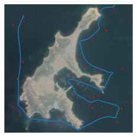

# 代码设计

1. 构建地图: 获得障碍物信息，生成目标点(随机数)
2. 聚类算法任务分配
    使用 A* 算法(或者任意一个从A-->B规划路径的算法) 构建目标点的全连接图, 并用谱聚类实现任务分配
3. 寻路算法获取 A-->B 路径
    SOM 算法
4. 样条法平滑路径
5. (无人艇运动控制系统)

## 1 构建地图

[scikit-image: Image processing in Python — scikit-image](https://scikit-image.org/)
[Scikit image 中文开发手册 - 开发者手册 - 云 + 社区 - 腾讯云](https://cloud.tencent.com/developer/doc/1221)

```python
import numpy as np
import matplotlib.pyplot as plt
from skimage import io, color, transform, morphology

%matplotlib inline
%config InlineBackend.figure_format = 'svg'
```

### 1.1 处理地图

```python
# 导入图片 original map
omg = io.imread("../Assets/Resources/Environment/890c.png")
omg = np.flip(omg, 0) # 图片翻转
omg = transform.resize(omg, (500, 500)) # 大小
plt.axis("off"), plt.gray()
plt.xlim(0, omg.shape[1])
plt.ylim(0, omg.shape[0])
plt.imshow(omg)
```

    <matplotlib.image.AxesImage at 0x2dea3915f10>


关于**坐标**：

- 图片矩阵是先 y 后 x, 对于坐标`(x,y)`, 对应 `img[y, x]`.
    - 访问图片坐标时倒过来就好, 其他正常.
    - 如果这一点不习惯的话，对于二维矩阵可以转置后再查找 `img[y, x] == img.T[x, y]`
        高维矩阵可以交换维度。
- 图片矩阵原点是图片的**左上角**，而一般习惯平面坐标系**左下角**是原点.
    - 所以显示图片的时候, imshow 的结果默认是左上角原点, 如果要按照习惯设左下角为原点，需要设置坐标轴(不过图片显示会颠倒).
    - 注意这里横坐标范围是 `img.shape[1]`, 原因同上.
    - 有一种解决方式就是把 img 的 y 坐标(第一维度)上下翻转. 即 `img=np.flip(img,0)`. 则等效为图片坐标原点转化为**左下角**.

```python
# 转换为灰度图并二值化 (这里选的是另一个更方便的图)
img = io.imread("../Assets/Resources/Environment/map_original.png")

img = color.rgb2gray(img)
img = transform.resize(img, (500, 500))
img = img < 0.44

img = np.flip(img, 0)  # 图片翻转, 图片坐标原点转换到左下角

img = morphology.binary_closing(img)  # 消除小黑点
img = morphology.binary_opening(img, np.ones((6, 6)))

plt.axis("off"), plt.gray()
plt.xlim(0, img.shape[1])
plt.ylim(0, img.shape[0])
plt.imshow(img)  # 得到一个 500x500 大小的地图

```

    <matplotlib.image.AxesImage at 0x2dea39487c0>


获取**障碍物**信息：

- 方法1: 输入一张地图图片，转化为灰度图像，设置合理阈值二值化处理，导出 0, 1 矩阵. (0 表示不可通行. 1 表示可通行.)
- 方法2: 下载高程图, 截取需要的地方

地图大小 500x500; 0表示不可通行, 1表示可以

> 用于改进的 tips: 开闭运算消除细小区域; 腐蚀操作扩大障碍区域判定范围

### 1.2 生成目标点

随机数生成

```python
import random

obstacle = morphology.binary_erosion(img, np.ones((10,10)))  # 扩大障碍物判定范围
target = []
while len(target) < 20:
    p = (random.randint(0, 499), random.randint(0, 499))
    if obstacle[p[1], p[0]]:
        target.append(p)
else:
    target = np.array(target)  # 最后转变为 ndarray

plt.axis("off"), plt.gray()
plt.xlim(0, img.shape[1])
plt.ylim(0, img.shape[0])
plt.imshow(img)
plt.scatter(target[:, 0], target[:, 1], color="#6495ED", s=5, marker="x")

```

    <matplotlib.collections.PathCollection at 0x2dec5422f40>


### 1.3 存档点

- 输入: 图片 img.png
- 输出:
    - ndarray img 障碍物信息
    - ndarray target 目标点信息

通用代码

```python
import pickle
import time

# 数据保存在 assets 下面

def save(var, name="data"):
    time_str = time.strftime("%Y%m%d%H%M%S")
    filename = f"{time_str} {name}.pickle"
    filepath = f"assets/{filename}"
    with open(filepath, 'wb') as f:
        pickle.dump(var, f)

    print("save {} to \"{}\"".format(type(var), filepath))

def load(filename):
    with open(f"assets/{filename}", 'rb') as f:
        data = pickle.load(f)
    return data
```

保存到文件

```python
# save(target, "targets")
# save(img, "map")
# save(omg, "original_map")
```

从文件读取

```python
target = load("20220423164508 targets.pickle")
img = load("20220423164508 map.pickle")
omg = load("20220423171747 original_map.pickle")
plt.axis("off"), plt.gray()
plt.xlim(0, img.shape[1])
plt.ylim(0, img.shape[0])
plt.imshow(img)
plt.scatter(target[:, 0], target[:, 1], color="#6495ED", s=5, marker="x")
```

    <matplotlib.collections.PathCollection at 0x2dec5496520>


## 2 分配任务点

这里的思路是用A星在500x500的网格中进行路径规划, 获得路径长度作为邻接矩阵对应位置的权重.


然后在此图基础上进行聚类.

**步骤**:

1. 输入 n 个数据
2. 计算 n 个数据两两之间的距离，对自己的距离是 0
3. 高斯函数将距离映射到 0-1 区间内的相似度, 对自己相似度是 1
4. 计算获得的数据组成了 nxn 的一个沿对角线对称的矩阵

n个目标点就要算 $1+2+…+n$ 个, 计算量比较大.
> 其实可以用一些更快的方法, 不需要获得精确的距离, 只需要获得的距离之间大致的大小关系就好了.
> 或者可以保存下来路径, 后续基于这个图, 用其他方法进行目标点排序, 排完再把路径拼起来

### 2.1 构建邻接矩阵

距离是按照**像素数目**计算的.

**WARNING**: 计算时间比较久

- 20 个目标点会计算 3min
- 30 个目标点会计算 4-5min

```python
from assets.astar import GridWithWeights, a_star_search, reconstruct_path

target_list = [(t[0],t[1]) for t in target]
graph = GridWithWeights(img)


def get_distance(graph, start, goal):
    """A*算法获得两点之间距离"""
    came_from, cost_so_far = a_star_search(graph, start, goal)
    path = reconstruct_path(came_from, start, goal)
    return len(path) - 1

def get_distance_matrix(targets):
    """targets: list of coordinates (ndarray)"""
    n = len(targets)
    adj = np.zeros((n, n)) # 距离自己距离0
    for i, p1 in enumerate(targets):
        for j, p2 in enumerate(targets[i + 1:]):
            # 计算 P1,P2 之间的距离
            distance = get_distance(graph, p1, p2)
            # 矩阵对应位置赋值
            adj[[i, i + j + 1], [i + j + 1, i]] = distance
    return adj

adj=get_distance_matrix(target_list) # 距离矩阵 (adjacency matrix?)
```

调参确定 gamma
可以通过画图的方法确定比较合理的参数.
gamma 越小, 数据越靠近1; gamma 越大, 数据越靠近 0; 理想情况是 0-1 之间近似均匀分布.

```python
gamma = 5e-6
affinity_matrix = np.exp(-gamma * adj**2)
for i in affinity_matrix:
    for index, j in enumerate(i):
        if j != 1.0:
            plt.scatter(index, j)
```


### 2.2 谱聚类

关于**聚类数**的确定:
有一种方法是计算不同 n 时代价函数，并画图.
有可能有一个拐点，前后斜率变化较大.

谱聚类的代价函数是切开的线的权值之和

```python
# from sklearn.cluster import KMeans
from sklearn.cluster import SpectralClustering

# 前面算好 affinity_matrix
cluster_number = 3
sc = SpectralClustering(n_clusters=cluster_number, affinity='precomputed')
cluster = sc.fit_predict(affinity_matrix)

plt.axis("off")
plt.xlim(0, omg.shape[1])
plt.ylim(0, omg.shape[0])
plt.imshow(omg)
#plt.scatter(target[:, 0], target[:, 1], color="#6495ED", s=6)  # 画上目标点
plt.scatter(target[:, 0],
            target[:, 1],
            c=cluster,
            marker='x',
            s=5,
            cmap="tab10")  # 画上目标点
```

    <matplotlib.collections.PathCollection at 0x2dec7d496a0>


### 2.3 存档点

保存数据

```python
# readme = """
# img: 20220423164508 map.pickle
# omg: 20220423171747 original_map.pickle
# target: 20 个目标点 ndarry 20220423164508 targets.pickle
# cluster: 3 个聚类结果
# affinity_matrix: 邻接矩阵
# """

# MAP = {
#     "omg": omg,  # 底图
#     "img": img,  # 二值化后障碍信息
#     "target": target,  # 目标点
#     "cluster": cluster,  # 目标点聚类结果(聚类数自己看)
#     "affinity_matrix": affinity_matrix,  # 邻接矩阵, 以免想要重新聚类
#     "readme": readme
# }

# save(MAP,"MAP")
```

读取数据

```python
MAP = load("20220423172802 MAP.pickle")
# MAP = load("MAP 20220212162020.pickle")
omg = MAP["omg"]
img = MAP["img"]
target = MAP["target"]
cluster = MAP["cluster"]
```

## 3 路径规划

### 3.1 关于 SOM

#### 3.1.1 一些说明

`som.py` 实现了基于SOM的避障算法.最初的最初, 来自[diego-vicente/ntnu-som: Using Self-Organizing Maps for Travelling Salesman Problem](https://github.com/diego-vicente/ntnu-som)
面向对象实现.

**归一化**:
一般用于 SOM 聚类应该需要各维度(特征)各自归一化，
但是如果两个维度分别是 x,y 坐标的话，应该同比例缩放，不然会影响距离的计算.
其实我觉得不归一化也可以, 只不过是坐标数值大小不一样

**初始化**:
本代码中, 初始结点随机分布在 target 坐标重心小范围附近.

一般神经网络权重设置为**标准化**小型随机值。
(也可以随机分布在地图内)
其实测试后结果差别不大. 原因大概是刚开始学习率很高，不管怎样都会震荡到全局.

- `self.network = np.random.rand(self.node_number, 2) * targets.max()`
- `self.network = np.random.rand(self.node_number, 2)`

#### 3.1.2 程序结构

使用SOM解决TSP问题的**核心结构**: (不一定能运行)

```python
import numpy as np
import matplotlib.pyplot as plt
import random

class Network():
    def __init__(self, targets):
        self.targets = targets
        self.node_number = targets.shape[0] * 15 # 神经元结点数目是目标点数的 15 倍
        
        # 初始化生成神经网络
        # 将坐标缩放到与任务点坐标相同范围
        # 正常情况下是对 TARGETS 进行归一化操作，这里是特殊情况
        self.network = np.random.rand(self.node_number, 2) * targets.max() 
        # 用在邻域函数里面的邻域半径
        self.radius = self.node_number  
        self.learning_rate=0.8 # 初始学习率设为 0.8
    
    def training(self):
        for _ in range(100000): # 循环更新

            target = random.choice(self.targets) # 随机选择一个目标
            winner_idx = self.select_closest(self.network, target) # 竞争，得到获胜节点

            # 更新获胜节点及其邻域
            gaussian = self.get_neighborhood(winner_idx, self.radius // 10)
            target_delta = gaussian[:, np.newaxis] * (target - self.network)
            self.network += self.learning_rate * target_delta

            # 更新学习率，缩小邻域
            self.learning_rate *= 0.99997
            self.radius *= 0.9997

            # 终止判断
            if self.radius < 1:
                break
            elif self.learning_rate < 0.001:
                break
    
    def select_closest(self, candidates, origin):
        """
        检索 array 中最小值的位置，并返回其下标值，即找到最相似 neuron
        Return the index of the closest candidate to a given point.
        """
        return self.euclidean_distance(candidates, origin).argmin()

    def euclidean_distance(self,a, b):
        """
        求 a-b 每一行的算数平方和开根号，也就是行向量之间的欧几里德距离了。
        Return the array of distances of two numpy arrays of points.
        """
        return np.linalg.norm(a - b, axis=1)

    def get_neighborhood(self, center, radix):
        """
        Get the range gaussian of given radix around a center index.
        """
        if radix < 1: # Impose an upper bound on the radix to prevent NaN and blocks
            radix = 1
        ## Compute the circular network distance to the center
        deltas = np.absolute(center - np.arange(self.node_number))
        distances = np.minimum(deltas, self.node_number - deltas)

        ## Compute Gaussian distribution around the given center
        return np.exp(-distances ** 2 / (2 * radix ** 2))
```

#### 3.1.3 单线拓扑结构

思路比较简单，就是拓扑结构从环状断开，其实还简化了一点.

**逻辑上**需要设置一个起点终点，不然得到的起点和终点是随机的. 可以根据实际需要进行设定.

**设定起点终点**:

- 方法1: 每轮迭代强制设定 SOM 路径起点终点为对应位置即可.
    虽然起点和终点并不作为目标点参与更新，但是通过引入的窗口机制(使结点均匀分布)，仍然可以保证其临近的结点向其靠近.
- 方法2: 每轮额外让拓扑结构的起点/终点朝向设定的起点/终点更新

#### 3.1.4 障碍检测

只对SOM结点的位置进行判断, 这样不严谨, 但判断**两点之间线段**是否与障碍物相交比较困难, 计算量也比较大.
可以通过添加结点数目弥补(计算量++).

#### 3.1.5 窗口更新

在这里实现的窗口更新可以理解为是一个比较激进的"滤波", 让结点平均分布并且躲开障碍物.
但是会很大程度上削弱原本算法让路径到达目标点的作用. "滤波"作用太强导致无法到达目标结点



胜者不变就是那些最接近各自目标点的结点不移动位置，带来的坏处就是结点分布不太均匀.

没有胜者不变 | 有胜者不变
-------|------
 | 
节点分布非常均匀, 但是"滤波"作用太强导致无法到达目标结点 | 通过固定最接近目标点结点的策略, 保证到达目标节点, 但是同时节点分布变得不均匀

#### 3.1.6 缺陷

SOM 模型比较简单, 存储的数据量少(只有结点的数据), 所以对于更新算法的设计要求更高.
SOM 的更新: 根据目标点选择最近的结点作为获胜节点, 获胜节点与相邻的结点一起靠近目标点.

1. 选取获胜节点时，仅依靠欧氏距离并没有考虑障碍信息. 也许可以通过路径规划算法找到那个真正靠近目标点的获胜节点, 但计算量会更大, 因为要判断目标点和所有结点的实际距离.
    - 一个可能的思路: 使用多个 A* 同时搜索, 先从一个最有可能靠近目标点的结点开始搜索，规划出路径后记录一下长度，然后看下一个结点，寻路过程中一旦代价超过这个长度的部分就直接舍弃掉，以此类推.
2. 更新规则方面, 更新算法是直线往前走, 如果有障碍物的话，按理说是沿着各自往目标点路径去走的路线更新. 计算量确实会很大（大概）
    - 也许可以用一些局部路径规划的方法, 沿着规划出的结果走一段（也许实际上是还可以接受）（但是这样算法就有点缝合怪）
        - ✨实际上如果节点的更新都是沿着避障的路径走一段, 可能效果就还不错, 并且不需要借助这里的窗口更新来避障了(只需要让结点均匀分布来保证每段的规划精度)
3. 窗口更新, 现在看来是一个简单的对一条线进行搜索, 并把结点放置在搜索结果上, (在当时写时是以一个"更新"的想法, 从原来的位置上下移动)
    - 如果把窗口更新范围扩大, 对更新算法进行改进, 可能就还是需要借助其他路径规划算法辅助更新.
    - 如果把窗口范围更新到目标点之间… 那么其实可以把SOM换成遗传算法

anyway… 如果要改进的话, 算法设计需要参考、结合一些成熟的算法… 但因此可能说明, 当前这个思路不具有优势.

### 3.2 Import & 工具

```python
from assets.som import Network

def plot_path(img, targets, network):
    """画路线图"""
    fig = plt.figure()
    axis = fig.subplots()
    axis.set_xlim(0, img.shape[1])
    axis.set_ylim(0, img.shape[0])
    plt.axis("off")
    axis.imshow(img)  # 画地图

    axis.scatter(targets[:, 0], targets[:, 1], marker='x', s=2.5,
                 c="r")  # 画任务点
    axis.plot(network[:, 0], network[:, 1])  # 画路线
    return plt.axis


def get_start_end(array):
    """单线 SOM 的话, 确定起点和终点
    (maximum - minimum) along an axis."""
    index = array.ptp(axis=0).argmax()  # 获得相距最远的轴 (x or y)
    start_index = array.argmin(axis=0)[index]
    end_index = array.argmax(axis=0)[index]
    start = array[start_index]
    end = array[end_index]
    return start, end
```

使用举例

```python
# start, end = get_start_end(target) # 确定起点和终点, 也可以随便指定
# net = Network(target, img, start, end) # set up network (targets, maze, start, end)
# net.training()
# path_lenghth = net.route_distance() # 获取长度
# print(path_lenghth, "km")
# plot_path(omg, target, net.network) # 画路线
# plt.scatter(start[0], start[1], marker='o', c="r", s=5)  # 画起点
# plt.scatter(end[0], end[1], marker='o', c="r", s=5)  # 画终点
```

### 3.3 SOM 根据聚类结果进行路径规划

```python
# 分配结果 cluster
distances = [] # 路径长度
routes = [] # 规划出的路径

for i in range(cluster.max() + 1):
    subt = target[cluster == i] # 目标点子集
    start, end = get_start_end(subt)
    net = Network(subt, img, start, end)
    net.training()
    routes.append(net.network)
    distances.append(net.route_distance())

plt.xlim(0, omg.shape[1])
plt.ylim(0, omg.shape[0])
plt.axis("off")
plt.imshow(omg)  # 画地图
plt.scatter(target[:, 0],
            target[:, 1],
            c=cluster,
            marker='x',
            s=5,
            cmap="tab10")  # 画任务点
for path in routes:  # 画路线
    plt.plot(path[:, 0], path[:, 1])
    # axis.scatter(path[:,0],path[:,1],s=1)
```


### 3.4 存档点

保存数据

```python
# readme = """
# 20220423172802 MAP.pickle, 30 个目标点, 3组分类 (全部都是 numpy 矩阵)
# """

# PATH = {
#     "routes": routes,  # list of paths array
#     "distances": distances,
#     "readme": readme
# }

# save(PATH, "PATHS")
```

读取数据

```python
PATH = load("20220423175003 PATHS.pickle")
routes = PATH["routes"]
distances = PATH["distances"]
MAP = load("20220423172802 MAP.pickle")
omg = MAP["omg"]
img = MAP["img"]
target = MAP["target"]
cluster = MAP["cluster"]

plt.xlim(0, omg.shape[1])
plt.ylim(0, omg.shape[0])
plt.axis("off")
plt.imshow(omg)  # 画地图

plt.scatter(target[:, 0],
            target[:, 1],
            c=cluster,
            marker='x',
            s=50,
            cmap="tab10")  # 画任务点
for path in routes:  # 画路线
    plt.plot(path[:, 0], path[:, 1])
    # axis.scatter(path[:,0],path[:,1],s=1)
```


## 4 路线平滑处理

### 4.1 B-spline 算法

`scipy.interpolate.make_interp_spline(x, y, k=3, t=None, bc_type=None, axis=0, check_finite=True)`

- `x` 是横坐标，即自变量（大概需要是递增的），用于区分 y 的顺序.
- `y` 是纵坐标， 也就是数据点（可以是高维的，但是行数得和 x 一样）
- `k` 是 B-Spline 的阶数, 默认的 3 就可以了
- `bc_type` :Boundary conditions. 可以设置为 `clamped` (The first derivatives at the ends are zero.)

```python
from scipy.interpolate import make_interp_spline
import matplotlib.pyplot as plt

# 极坐标图形
phi = np.linspace(0, 2.*np.pi, 40) # 0~2pi
r = 0.3 + np.cos(phi)
x, y = r*np.cos(phi), r*np.sin(phi)  # convert to Cartesian coordinates
P=np.c_[x, y] #　按列合并x,y作为目标点

# Build an interpolating curve, parameterizing it by the angle
spl = make_interp_spline(phi, P)

# 用更细间距的自变量计算插值结果
phi_new = np.linspace(0, 2.*np.pi, 100)
x_new, y_new = spl(phi_new).T # 这里把 P_new 拆开

# 绘图比较
plt.plot(x, y, 'o')
plt.plot(x_new, y_new, '-')
plt.show()
```


#### 4.1.1 在这里进行一定的改进

- 原始路径 $p_1,p_2,\dots,p_n$ --> 计算路径点之间的距离并累积, 然后归一化生成一个 0-1 的索引序列
    - 最终结果是一个递增的数列, 表示了路径点所处位置路线长度的映射
    - 这样平滑函数可以输出等间距的数据点
- 初次平滑, 输出节点 $k_1,k_2,\dots,k_m$
    - 特点是沿路径均匀分布(前提是之前SOM算法输出的结点很密, 导致这里平滑过后仍然很大程度上符合原来的路径)
    - 这里设置 m 要小一些, 相当于从原始路径点中等路径间距取样("降采样"). (这个步骤的目的)
        - m 某种程度上反映了对路径精确程度的要求, 如果等间距 10m 取样, 则说明 10m 以内的路径变化被忽略掉了
- 二次平滑, 使用 $k_1,k_2,\dots,k_m$ 进行平滑. m 越小路线越平滑.


### 4.2 平滑路径

```python
from scipy.interpolate import make_interp_spline


def bspline(path, precision=20):
    """考虑路径长度进行圆滑处理
    默认输入路径 15m 一个路径点, 输出 0.7m 1个路径点
    """
    di_vec = np.diff(path, n=1, axis=0)  # 沿行一阶差分
    di_dis = np.linalg.norm(di_vec, axis=1)  # 相邻路径点之间的欧氏距离
    di_dis = np.insert(di_dis, 0, 0, axis=0)  # 开头插入一个 0
    di_overall = sum(di_dis)  # 路线总长度
    di_index = np.cumsum(di_dis) / di_overall  # 先累积距离，再除以总长度，变成0-1的索引

    # 初次平滑, 隔 precision(m) 输出一个路径点 "降采样"
    spl1 = make_interp_spline(di_index, path, bc_type="clamped")
    t1 = np.linspace(0, 1, int(di_overall // precision))
    splined_routes1 = spl1(t1)

    # 二次平滑, 每隔 1m 输出一个路径点
    spl2 = make_interp_spline(t1, splined_routes1, bc_type="clamped")
    t2 = np.linspace(0, 1, int(di_overall // 1))
    splined_routes2 = spl2(t2)
    return splined_routes2


# # test code
# path=routes[0]
# distance=distances[0]

# splined_routes = bspline(path)
# plt.plot(path[:, 0], path[:, 1], '-', alpha=0.25, c="gray",linewidth=3)
# plt.plot(splined_routes[:, 0], splined_routes[:, 1], '-',alpha=0.5)
# plt.scatter(splined_routes[:, 0], splined_routes[:, 1],s=1, c="red")

```

```python
precision = 20 # 精度 20m
splined_routes = []
for path in routes:
    splined_routes.append(bspline(path,precision))

plt.axis("off")
plt.xlim(0, omg.shape[1])
plt.ylim(0, omg.shape[0])
plt.imshow(omg)
# plt.scatter(target[:, 0], target[:, 1], color="#6495ED", s=6)  # 画上目标点

plt.scatter(target[:, 0],
            target[:, 1],
            c=cluster,
            marker='x',
            s=5,
            cmap="tab10")  # 画上目标点

# 绘图比较 灰色的是原始, 彩色的是平滑过后的
for i, j in zip(routes, splined_routes):
    plt.plot(i[:, 0], i[:, 1], '-', alpha=0.75, c="black", linewidth=2)
    plt.plot(j[:, 0], j[:, 1], '-', linewidth=1)

```


## 5 最终结果输出

输出一组 targets & path

matlab 沿 path.csv 仿真

```python
# splined_route = splined_routes[0]
# plt.plot(splined_route[:, 0], splined_route[:, 1], '-', linewidth=1)
# st = target[cluster==0]
# plt.scatter(st[:,0],st[:,1],marker="x")

# for index, path in enumerate(splined_routes):
#     np.savetxt(f"path{index}.csv", path, delimiter=',', fmt='%.3f')
# np.savetxt("all_targets.csv", target, delimiter=',', fmt='%.3f')

```
