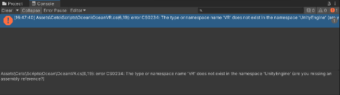

# README

[CetoManual_1_1_3.pdf | 由 Box 提供支持](https://app.box.com/s/pn542utrd5kd3t6yoc8lqhta9kb83qmr)
[Ceto (Scrawks Ocean) - Unity Forum](https://forum.unity.com/threads/ceto-scrawks-ocean.323545/)
[Scrawk/Ceto: Ceto: Ocean system for Unity](https://github.com/Scrawk/Ceto)
> [[GitHub] Unity中实现水、海洋以及液体模拟的仓库合集 - 简书](https://www.jianshu.com/p/affd155e9ef1)

## 1 Adjustment

## 2 Trouble Shooting

[[记录]开发Hololens时Unity报错缺少UnityEngine.VR命名空间的问题_泉城老侠客的博客-CSDN博客](https://blog.csdn.net/Roadlun/article/details/82180303)

`OceanVR.cs` 中进行相关修改就好了.
