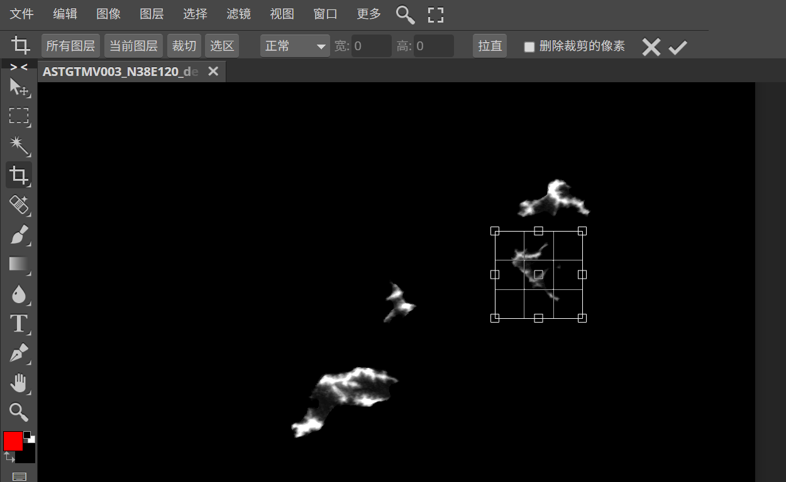

---
aliases:
tags:
date created: 2022-04-20 19:03:42
date modified: 2022-04-21 18:49:24
---

# 地图生成

> [YouTube 上学习的 Unity 程序化地形生成](https://www.bilibili.com/video/BV1gm4y1976E/?spm_id_from=333.788.recommend_more_video.2)
> [unity Dem 数据生成地形_哔哩哔哩_bilibili](https://www.bilibili.com/video/BV1K4411M7U6)

[[干货] [Unity] 如何将高程影像数据导入 unity 场景生成地形_哔哩哔哩_bilibili](https://www.bilibili.com/video/BV1aT4y1i7k1/?spm_id_from=333.788.recommend_more_video.1)

## 1 获取原始地图

- 高程图
- 卫星影像图

!!! warning
    注意卫星图和高程图要统一裁剪. 大小位置都要完全一样.
    这样才能对的上. (似乎像素点可以不完全一样, 只要等比例缩放对的上就行)

### 1.1 高程图

#### 1.1.1 下载

[地理空间数据云](http://www.gscloud.cn/#page1/2)

#### 1.1.2 处理

[DEM 处理——为 TIFF 文件创建 TFW 文件 - 知乎](https://zhuanlan.zhihu.com/p/370308212) 这里面说, 下载下来的 `dem.tif` 是高程图, `num.tif` 是误差. 所以就用前者就好了
高程影像图 越白越高.

在 Unity 的地形工具中高度图的大小必须是 2 的 N 次方 (正方形), RAW 格式

裁剪获得想要的区域

图像 --> 调整 --> 去色. 变成黑白图像(好像不做也行)

导出为 RAW 格式, ~~注意这里宽高和 Unity 里面设置一致~~. 通道要输出**单通道**!

### 1.2 卫星图

#### 1.2.1 下载

[高德地图,高德卫星地图,高德高清卫星地图](http://www.weixingditu.com/gaodeditu/)
[卫星地图-Google Earth 高清卫星地图-谷歌地图-地球在线](https://www.earthol.com/) 挺清楚的, 但是好像没法下载
[地理空间数据云](http://www.gscloud.cn/#page1/2) 有的数据库有卫星图. 如 Landsat4-5 TM 卫星数字产品.
然后我发现, 好像没有既是卫星影像图又是高程图的, 所以还是自己分别找一找, 然后尽量让它们贴合起来吧….
最后我用的是这个 [卫星地图下载_高清卫星地图下载_卫星地图高清](http://www.bigemap.com/reader/satellitemap/dhsm/#start) 但是还得要授权, 所以我就直接截图了 233

#### 1.2.2 处理

就保证和高程图一样大小, 一样位置就好了.
我的方法是分别位于两个图层, 然后自己对一下.

- 编辑 --> 自由变换 调整大小
- 形状有点对不上… 使用 编辑 --> 变换 --> 变形. 让他俩基本贴合.

> 其实高程图只是用来生成 Unity 里面的地形, 大致形状一样就可以了.

## 2 Unity 生成地形

### 2.1 Unity Terrain Tools 生成地形

导入之后可能默认地形会很尖锐, 比较离谱. 调整一下地形高度就好了.

[General settings | Terrain Tools | 4.0.3](https://docs.unity3d.com/Packages/com.unity.terrain-tools@4.0/manual/toolbox-general-settings.html?q=Terrain%20width) 根据这里的说明, 单位是米.
如果我在代码中认为一个像素距离是一米, 想和这里统一起来. 那就需要设置一下了.

### 2.2 创建材质贴图

添加 material, 然后如图所示.

把 material 添加到 terrain 上

## 3 调整地形

地形位置是 0, 海的位置是 0. 就会出现这样比较不好的样子.

解决办法是, 让地形的位置下降一点. 如 -5m.

