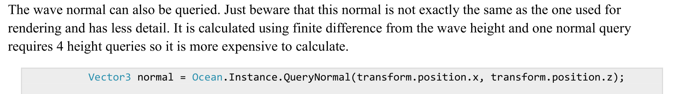
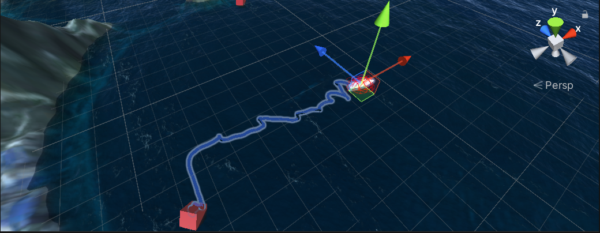
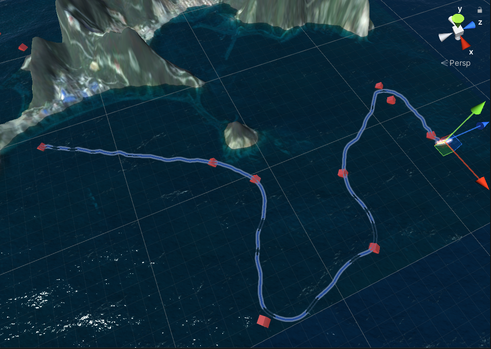
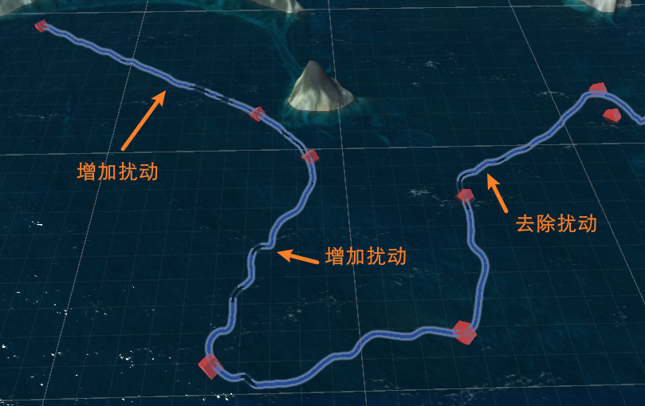

# Unity3D

!!! info inline end ""
    

场景 Auto

- 海洋环境 `Ocean_OpaqueQueue` [^ceto]
- `Targets` 用于生成、展示目标点
    - `LoadTargets.cs`
- `USV Group` 用于生成、控制无人艇
    - `Navigation.cs` 创建无人艇, 并实时更新无人艇控制的参考输入, 即导引算法
    - `USV Variant` 预制体
        - `KinematicUSV.cs` 无人艇运动学模型
        - `Disturbance.cs` 随波浪飘动. (crest 海洋环境有现成的效果[^crest])
        - `MoveController.cs` 创建ADRC控制器对无人艇的速度和航向进行控制
            - `class ADRC` ADRC 控制器

[^ceto]: [Scrawk/Ceto: Ceto: Ocean system for Unity](https://github.com/Scrawk/Ceto)
[^crest]: [wave-harmonic/crest: An advanced ocean system implemented in Unity3D](https://github.com/wave-harmonic/crest)

## 1 关于无人艇模型 `KinematicUSV.cs`

Unity 中有刚体组件可以添加力之类的, 但是无人艇运动模型要更复杂一些, 我没想到如何用Unity的刚体实现此模型.
`KinematicUSV.cs`, 根据控制器给出的推力和转矩, 对 transform 进行更新. (也保留外部对其更改)

后续应该与刚体组件进行兼容,
例如舍弃无人艇模型中的 x, y, psi 状态变量, 直接由Unity里的坐标和旋转信息获取.
无人艇模型中的速度和角速度与刚体组件的速度和角速度同步. (?)
这样通过对刚体组件施加力, 就可以通过 `KinematicUSV.cs` 计算得到速度. (?)

## 2 关于推力限定与ADRC控制

MATLAB 里螺旋桨推力限定为 $[0,50]$,

但是螺旋桨反转的话, 力的方向就相反. 所以推力可以为负

ADRC 需要调整:

1. **控制量输出震荡比较大**, 参数应该还需要再调一下, 对于微小偏差反映比较大
2. 还有很重要的一点是, 另外对力进行限定的话, 又会产生一部分系统设计带来的"扰动", 例如控制器输出 100, 经过限定后变为 50, ADRC 会认为存在扰动并尝试增大输出来抵消此"扰动". 这有可能是控制器输出震荡的原因之一.

## 3 运行期间控制观察角度

给 camera 挂脚本, 键盘控制, 调整 transform

 [UnityEngine.Transform - Unity 脚本 API](https://docs.unity.cn/cn/current/ScriptReference/Transform.html)
 [【Unity3D】键盘鼠标控制视角的移动_yongh701 的博客-CSDN 博客_unity 鼠标控制视角](https://blog.csdn.net/yongh701/article/details/71082441)

## 4 控制船位移 Transform

> **查表**

### 4.1 船的位置

1. 直接更新 position  `transform.position = transform.position + delta;`
2. [Transform-Translate - Unity 脚本 API](https://docs.unity.cn/cn/current/ScriptReference/Transform.Translate.html)

对于第二种方法，默认是船自身的坐标系。但是如果你的目标点、速度是在世界坐标系下的，就需要指定一下了。

### 4.2 船的角度

Transform.rotation 存储的并不是 Inspector 面板上看到的
> [Transform.rotation](https://docs.unity3d.com/cn/2020.3/ScriptReference/Transform-rotation.html) 存储 [Quaternion](https://docs.unity3d.com/cn/2020.3/ScriptReference/Quaternion.html)。可以使用 [rotation](https://docs.unity3d.com/cn/2020.3/ScriptReference/Transform-rotation.html) 来旋转 GameObject 或提供当前旋转。请勿尝试编辑/修改 [rotation](https://docs.unity3d.com/cn/2020.3/ScriptReference/Transform-rotation.html)。[Transform.rotation](https://docs.unity3d.com/cn/2020.3/ScriptReference/Transform-rotation.html) 小于 180 度。

要查看面板上显示的角度, 可以使用 `transform.rotation.eulerAngles`

1. rotate:
2. look at: 只需要知道船要对准的点(也就是目标点)就好了
    [Transform-LookAt - Unity 脚本 API](https://docs.unity.cn/cn/current/ScriptReference/Transform.LookAt.html)

[Unity欧拉角、四元素、旋转量_deanchang的博客-CSDN博客_unity欧拉角旋转顺序](https://blog.csdn.net/cjj7905150/article/details/113606953)

#### 4.2.1 平滑旋转

[Transform-rotation - Unity 脚本 API](https://docs.unity3d.com/cn/2020.3/ScriptReference/Transform-rotation.html)
[Quaternion-RotateTowards - Unity 脚本 API](https://docs.unity3d.com/cn/2020.3/ScriptReference/Quaternion.RotateTowards.html) 这个可以指定方位, 慢慢旋转.

#### 4.2.2 直接设定角度

`transform.eulerAngles = new Vector3(0, psi, 0);`
这个修改就和面板上的数据一致了.
`transform.rotation = Quaternion.Euler(90, 0, 0);` 这个效果好像也一样.

##### 4.2.2.1 角度转化问题

Unity3D 里船头朝向的角度是 $\theta_1$, 原始数据是 $\theta_2$
两者关于 $\frac\pi 4$ 对称. 满足关系 $\theta_1+\theta_2=\frac \pi 2+2k\pi$ (不知道应该怎么推导, 我归纳出来的)


#### 4.2.3 FromToRotation

[Quaternion-FromToRotation - Unity 脚本 API](https://docs.unity3d.com/cn/2020.3/ScriptReference/Quaternion.FromToRotation.html) 让一个轴指向指定的方向.
> Usually you use this to rotate a transform so that one of its axes eg. the z-axis - follows a target direction `toDirection` in world space.

指定船的 z 轴始终指向 世界坐标系下的某个方向.
`System.Math.Sin()` 使用弧度单位.
计算弧度时, `30 / 180 * Math.PI`, 不起作用… 要把 PI 放前面, ~~不知道为啥~~ 原因是 `C#` 计算的前两个数都是整数, 得到的就是整数 0… 除了 PI 放前面, 还可以变成 `30.0` .

只能保证 z 轴指向, 并不能保证其他轴不变…


## 5 生成任务点

根据预制体生成新的物体是参考的 [unity 用代码加载并创建一个预制体实例以及设置 position_lifereset 的博客-CSDN 博客_unity 代码加载预制体](https://blog.csdn.net/qq_38913715/article/details/120363368)
> 可能也有其他方法 [Unity 编辑器拓展功能之代码动态创建预制体_lq1340817945 的博客-CSDN 博客_unity 动态创建预制体](https://blog.csdn.net/lq1340817945/article/details/105596545)

生成的物体默认是放在最外边… 想要设置层级关系为子物体.

!!! note "设置物体的 father"
 [UnityEngine.Transform - Unity 脚本 API](https://docs.unity.cn/cn/current/ScriptReference/Transform.html)
    Unity 的层级关系是体现在 transform 里面.
    child 的 transform 位置以 father 的 transform 位置为起点.
    设成子物体的好处在于:
    1. 看着不乱
    2. 可以统一管理
         1. 方便查找 [Transform-Find - Unity 脚本 API](https://docs.unity.cn/cn/current/ScriptReference/Transform.Find.html)
         2. 同步更新 `foreach (Transform child in transform) { xxx }`

最终可以这样写:

```C#
GameObject go = GameObject.Instantiate(Resources.Load("Target")) as GameObject;
go.transform.position = new Vector3(0, 0, 0);
go.transform.SetParent(GetComponent<Transform>()); 
```


### 5.1 Further

 [Object-Instantiate - Unity 脚本 API](https://docs.unity.cn/cn/current/ScriptReference/Object.Instantiate.html)
一方面其实可以在最开始就指定 position 和 parent. (不过代码就会很长)
另一方面 "这些方法不会创建与新实例化对象的预制件连接。可以使用 [PrefabUtility.InstantiatePrefab](https://docs.unity.cn/cn/current/ScriptReference/PrefabUtility.InstantiatePrefab.html) 创建具有预制件连接的对象。"

## 6 画线

 [线渲染器 (Line Renderer) - Unity 手册](https://docs.unity3d.com/cn/2018.4/Manual/class-LineRenderer.html)
 [轨迹渲染器 (Trail Renderer) - Unity 手册](https://docs.unity3d.com/cn/2018.4/Manual/class-TrailRenderer.html)

创建一个空物体，然后添加 Trail Renderer. 这样好调线的位置.
然后线添加材质, 控制外观.

## 7 环境搭建

见 [Scene 部分](./Scene/).

## 8 `Disturbance.cs`

!!! summary
    其实波浪扰动应该是获得一个力和力矩, 然后通过 Unity 里的刚体组件施加.
    但是我暂时没找到好的方法让船的模型与刚体组件相融合
    总的来说, 只是实现了一个简简简易版本的扰动作用

随波浪流动的干扰效果

查询波浪信息, 从而获得一个扰动
主要参考: CetoManual

使用 Ceto namespace 后, `Ocean.Instance` 可以查询到当前海洋物体.

**波浪信息查询:**
**`WaveQuery query = new WaveQuery(transform.position);`**
可在代码中找到 **WaveQuery** 的定义, 及其可查询到的信息.
Ocean 类的 Query 方法也可以用. 细节不一样.

**波高**


**法线**


**波速**
手册里没有提, 但是可以从 WaveSpectrum 中获取到.
`Ocean.Instance.Spectrum.waveSpeed`

**随波浪前进**
displacementX, displacementZ 是两个方向上的位移

上图代码把速度替换成波速 (乘以deltaTime) 就是随波浪流动了.

!!! note "修改位置"
    
后来发展, 这种扰动作用的实现是直接修改船的位置, 不会影响 KinematicUSV 里面的速度和角度, 进而也不会被(速度和角度)控制器观测到.

!!! note "修改速度"
    后来改成修改速度和角度. 将波浪的速度与船的速度进行叠加.
    单纯扰动作用下船的轨迹 (速度在0.5m/s-6m/s)
    
    
    
    这样看的话其实扰动挺小的… 但是是每次更新都会改变这么多, 计算一个累积量就知道了.
    其实前半段是体现了抗扰作用, 但是当扰动相对大到一定程度效果就不好了
    比如中间突起那一段, 还有后半段当船速下降后, 系统就开始不稳定了… (也有可能是我实现的方法有未知bug)
    
    总的来说, 扰动的实现需要有更好的方法.



逐渐增加强度, 印证了上面的想法… 扰动小时可以抵消一些, 大时就不稳定了.


## 9 坐标系

有一个不一样的坐标系, 比较容易混淆, 简单总结一下:


- 普通坐标系是我们一般习惯的, 左下角是坐标原点的坐标系.
- Unity 里的坐标系(这里不提垂直方向的y), 名字变了, psi (旋转角度) 方向变了, 规律是: 与普通坐标系下计算得到角度的和是$0.5\pi+2k\pi$
- 船坐标系其实和Unity里的坐标系是一致的, 只有名字变了.
- 另外, 船坐标系和普通坐标系沿 y=x 有对称关系, 就像一张纸从正反两面去看… 所以计算的时候是一样的… 假如你在普通坐标系下计算 f(x,y), 在 船/Unity 这个坐标系下计算 f(y,x) 结果是一样的. (总之有点乱…)
- 总之…
    - 普通坐标系转换为 Unity 坐标系: Unity_z=Norm_x; Unity_x=Norm_y;
    - 船坐标系转换为 Unity 坐标系: Unity_z=Boat_x; Unity_x=Boat_y;

在三个体系下有三套坐标系, 但不论怎样, 计算时画好坐标系, **统一成一个**才不会算错
