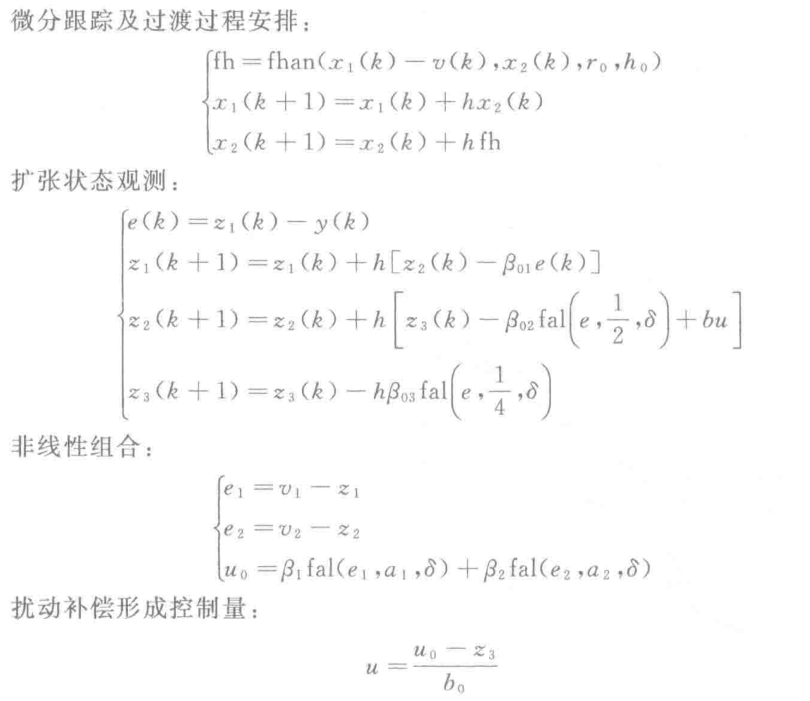
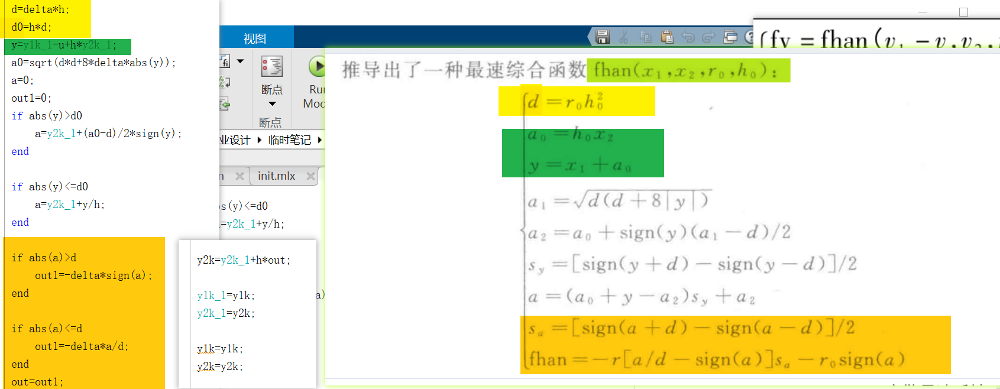

# 模型编写

!!! summary
    控制器/系统编写-->把**微分/差分方程**转化成代码.
    (MATLAB) 对于简单的部分, 可以使用图形化方法拖拽链接.
    复杂部分图形方法不便组合, 可以使用 S-Function 或者 MATLAB Function.
    只需要明确 **输入**, **输出**, **状态变量**, 以及状态变量如何**更新**. 相隔固定周期调用更新函数即可.

## 1 USV 编写

$m_{11}=m_{22}=33kg,\quad m_{33}=10kg·m^2,\quad m_{23}=m_{32}=3.3kg·m$
$d_{11}=d_{22}=d_{33}=5,\quad d_{23}=d_{32}=0$
考虑到USV螺旋桨的推进能力和转向能力，系统的最大推进力$F_{max}=100N$和最大转向力矩$T_{max}=50N·m$ [^para1]
[^para1]: 参考《基于自抗扰控制的水面无人艇路径跟踪控制器 王常顺》

另外, 建立 $F_p,F_s$ 和 $\tau_u,\tau_r$ 的关系时, 需要用到 $d_y$, 这里取$d_y=1$. [^para2] 参考上面最大限制, 则可以取左右推力的约束为 $0\le F\le 50N$.
(回过头来想… 如果是螺旋桨, 反转不就能让力方向相反了嘛? 所以应该是 $-50\mathrm{N}\le F\le 50\mathrm{N}$ )
[^para2]:参考《欠驱动水面艇运动控制建模及三维仿真实现研究 王国英》中, 水面艇总长 6.70m, 总宽2.8m, 总高1.60m

主要思路就是把微分方程整理成 $\dot{x}=\cdots$ 的形式, 然后搭建

- 基本模块搭建: 加入积分器, 积分器输出端是 $\dot{x}$, 输入端是等号右侧各个信号的和. 无人艇并非线性系统, 因此不能直接使用 simulink 中那个状态方程模块搭建.
- 使用 S-Function 也可以

无人艇模型的输入是$\tau_u,\tau_r$ (实际是左右推力 $F_p,F_s$), 输出是 $x,y,u,v,r$ 之类的

## 2 ADRC 编写

ADRC 差分方程形式[^adrc]:
[^adrc]: 《自抗扰控制入门》 by 朱斌

| (子)系统 | 输入 | 输出 |
| --- | --- | --- |
| 整体 | 给定信号,被控系统输出 | 控制量 |
| TD | 给定信号 | 过渡过程(滤波后的给定?)及其微分 |
| ESO | 被控系统输入(即ADRC输出)和输出 | 观测的状态变量 |
| NLSEN | "误差"及其微分 | 组合后的控制量 |

??? example "论文[^thesis]里的形式"
    [^thesis]: [基于自抗扰控制的水面无人艇路径跟踪控制器 - 中国知网](https://kns.cnki.net/KCMS/detail/detail.aspx?dbcode=CJFD&dbname=CJFDLAST2016&filename=SDGY201604009&v=)

    基本上是一样的, 只是符号不一样

    
    
    

    !!! attention
        论文中 TD 的参数 $h_0=h$ , 即 $h_0$ 和更新步长一致, 但是书上[^adrc]说可以取为h的若干整数倍, 效果更好, 因此我觉得还是区分开更好.
        另外这些参数直接使用似乎效果不太行, 略微修改了一下.

> ADRC 的公式可能有其他形式(?), 下图左右略有不同.
> 左边是别人的ADRC代码
> 
