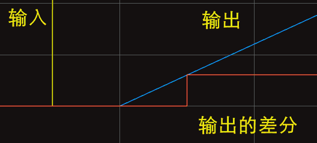
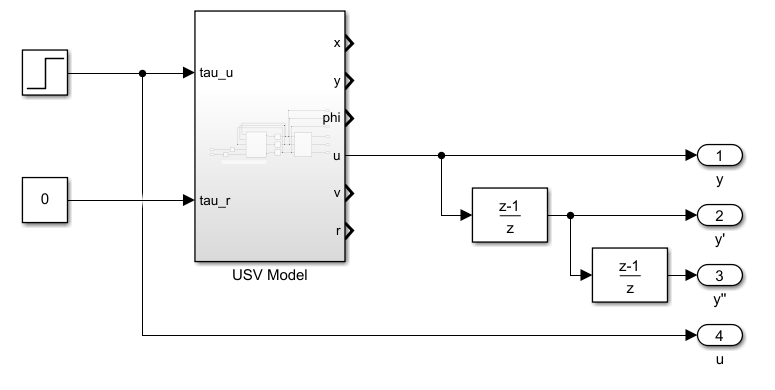
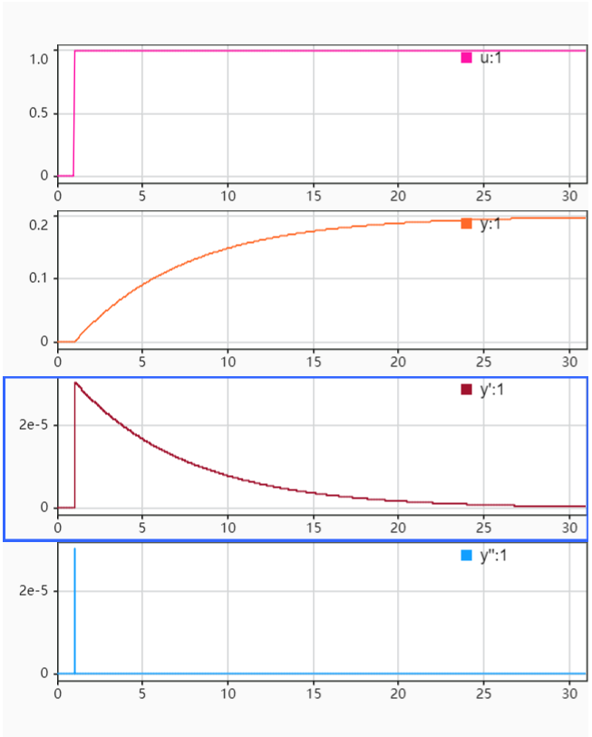
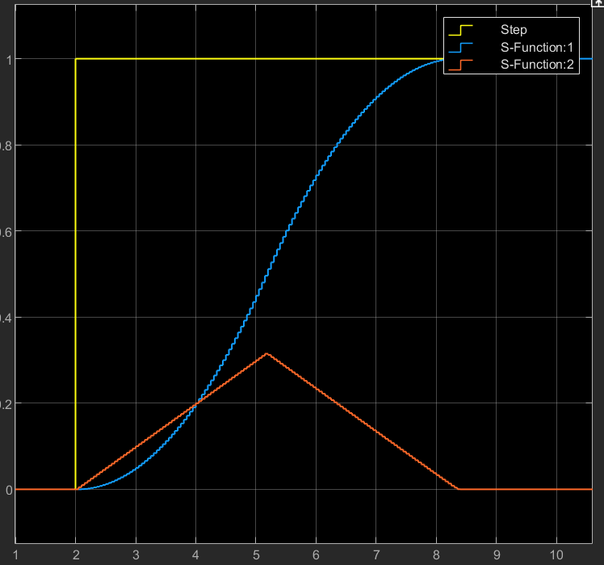

# 其他

> 一些零散的记录

## 1 LADRC 调试

$b$ 值确定:
$\ddot y=f(\dots)+bu$, 可以由"阶跃响应初始加速度"获得 $b$
例如系统  $\ddot y=-2\dot y-3y+bu$
原理大致是, 最刚开始 $\dot y=y=0$, 那么 $f=-2\dot y-3y=0$
此时阶跃响应 $u=1$, $\ddot y=b$ .

系统离散化后是 $y(k+2)=−2y(k+1)−3y(k)+bu(k)$
我们可以直接计算的差分是 $y(k+1)-y(k)$, 而导数信息应该为 $\dot y=\frac {y(k+1)-y(k)}{h}$,
同理可以推出二阶导数为 $\ddot y =\frac{y(k+2)-y(k)}{h^2}$.
阶跃响应最刚开始, $y(k+2)$ 最先出现变动, $y(k)=y(k+1)=0$. 代到原式可以有 $y(k+2)=u(k)$ 这样能够算出来$b_0=b$.

!!! note "关于更新"
    
    很容易理解, 在 simulink 中, 仿真中数值的更新是一步一步的.
    即使搭建连续系统, 计算机最终还是转化成离散的进行一步步更新. 导数阶次越高的最先响应.
    对于系统  $y''=-2y'-3y+u$ , 离散化后是 $y(k+2)=-2y(k+1)-3y(k)+u(k)$,
    肯定是 $y(k+2)$ 先产生变化, 在那之前 $y(k+1)=y(k)=0$

总之:

- 获取输出的差分, 进而从会变化的最高阶的差分获取到系统阶数以及 $b$
    - 虽然理论上说是可以这样测, 但是实际上也可以通过经验试凑…
    - $b$ 越小, 控制作用越强, 如果$b$设置的很小很小, 那么系统的响应又快又没有超调. 但实际系统控制作用是有限的. $b$ 设置的大到一定程度, 就不稳定了.
- 阶数取低了好像会不太稳定… 输出不收敛, 阶数取高了我也没试过会发生什么

??? example "测定 $\tau_u-u$ 的 $b$"
    
    曲线大致为下图: $y(k+1)-y(k)=3.03e-5$, 表明 $y'=f+30.3u$, 即 $\tau_u-u$ 是一阶关系(使用一阶ADRC就可以了)
    

## 2 ADRC 调试

TD 配置过渡过程, 有人说是起滤波作用, 对参考值的突变进行平滑处理.
但是这个"过渡过程"的配置也许并不是必须的, 可以根据实际情况自行设定过渡过程.
TD 存在的情况下, 它配置的过程的快慢决定了系统速度的上限.

