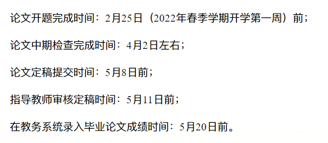

# README

3 月底中期答辩
5 月底最终答辩

希望自己这次做的时候吸取教训，把要实现的任务拆分成单独的模块，逐一实现，改进的话也方便很多

有一个很重要的事情。.. 就是事情的效率

1. 计划好要实现什么功能
2. python 尝试实现（即便简略）
3. 有精力/完全完善后再写 markdown 文件

无人艇以其成本低、机动性强、隐蔽性能好等优点，在军事和民用领域中发挥着越来越重要的作用，国内外学者针对如何提升无人艇的自主性能展开了大量研究，其中路径规划是实现无人艇自主航行的一种关键技术。传统的路径规划方法仅考虑了基础的避障需求与路径优化指标（如路径长度、航行时间、能量消耗等），而忽视了**多任务点约束**，但该类约束在水质采样等任务中不可忽视。此外，无人艇还需精确跟踪规划的路径以完成任务，而**水流、风等扰动**会大大影响控制精度。
本论文研究面向**多任务点的无人艇协同路径规划**与**跟踪控制方法**。

首先，采用谱聚类方法将任务点分配给相应的无人艇，实现多无人艇任务分配；

然后，利用改进的自组织映射神经网络方法，确定各无人艇对分配任务点的最优访问顺序，同时可安全躲避障碍物；

接着，对规划路径进行平滑处理，并利用自抗扰控制方法实现无人艇对规划路径的精准跟踪；

最后，搭建 unity3D 虚拟仿真场景并进行验证。

开题需要完成的内容：
阅读若干篇关于目标分配、路径规划、路径跟踪的文献；学习 Python 语言；学习 unity3D 软件

中期检查内容：
完成基于谱聚类的多无人艇任务分配；完成基于自组织映射的单无人艇路径规划；完成基于自抗扰控制的无人艇路径跟踪。

结题需要完成的内容：
完成基于谱聚类的多无人艇任务分配；完成基于自组织映射的单无人艇路径规划；完成基于自抗扰控制的无人艇路径跟踪；完成 unity3D 场景下的虚拟视景仿真。

!!! warning
    关于笔记，我把一些以前的给合并进来了. 项目结束后别忘了归档恢复回去.
    > 谱聚类，A star ...

## 1 Furthermore

未完成的计划
[运动规划_哔哩哔哩_bilibili](https://www.bilibili.com/video/BV1Et4y167Ak/)
样条法平滑路径

双推进器无人艇模型 , 3自由度 xy 旋转 ⇒ 自适应抗扰, MATLAB仿真

论文: 采用这篇论文的无人艇模型，另外第2章的路径跟踪方法（即导引方法）也试试经典的视线导引法

c#: 语法 ✅ 后面有需要再回来看
[【01_C#入门到精通】新手强烈推荐：C#开发课程，一整套课程_哔哩哔哩_bilibili](https://www.bilibili.com/video/BV1FJ411W7e5)
先学语法不安装IDE.......
[(5 条消息) #region_飞鸿的博客 - CSDN 博客_#region](https://blog.csdn.net/weixin_38465623/article/details/80306743)
[(5条消息) C# #region 简单使用_进阶的小白 - CSDN 博客_#region](https://blog.csdn.net/qq_31671139/article/details/108359459)
[C#急速入门_哔哩哔哩_bilibili](https://www.bilibili.com/video/BV1Yb411u73S/?spm_id_from=333.788.recommend_more_video.6)

UNITY 3D
<https://www.bilibili.com/video/BV1qA411M7dY/?spm_id_from=trigger_reload>
[如何自学unity，一个自学半年的up的建议_哔哩哔哩_bilibili](https://www.bilibili.com/video/BV1e7411u7Wk/?spm_id_from=333.788.recommend_more_video.2)
[https://www.luogu.com.cn/](https://www.luogu.com.cn/) 做题网站!
微软 C# 函数文档 [https://docs.microsoft.com/zh-cn/dotnet/api/?view=netframework-4.8](https://docs.microsoft.com/zh-cn/dotnet/api/?view=netframework-4.8)
www.bilibili.com/video/BV1Yh411h7zk/ Unity 的使用介绍 后期再看一看
Unity 函数文档 [https://connect.unity.com/doc](https://connect.unity.com/doc)
[Yu_Zhen的个人空间_哔哩哔哩_bilibili](https://space.bilibili.com/171199489)

适合我回答，我也研一控制。
首先，我极度极度推荐 B 站一位 up 主 - DR_CAN！这位博主是位在 ABB 做机器人的 PHD，视频太牛了。有对现控的讲解，对构建李[雅普诺夫](https://www.zhihu.com/search?q=%E9%9B%85%E6%99%AE%E8%AF%BA%E5%A4%AB&search_source=Entity&hybrid_search_source=Entity&hybrid_search_extra=%7B%22sourceType%22%3A%22answer%22%2C%22sourceId%22%3A%22539053978%22%7D)函数的讲解，对 Backstepping，滑模，自适应等等具体算法简单应用的讲解，还教你怎么写文章等一系列视频，真心推荐给所有学控制的同学。
滑模和神经网络的话推荐[刘金锟](https://www.zhihu.com/search?q=%E5%88%98%E9%87%91%E9%94%9F&search_source=Entity&hybrid_search_source=Entity&hybrid_search_extra=%7B%22sourceType%22%3A%22answer%22%2C%22sourceId%22%3A%22539053978%22%7D)老师的滑模变结构控制，RBF[神经网络控制](https://www.zhihu.com/search?q=%E7%A5%9E%E7%BB%8F%E7%BD%91%E7%BB%9C%E6%8E%A7%E5%88%B6&search_source=Entity&hybrid_search_source=Entity&hybrid_search_extra=%7B%22sourceType%22%3A%22answer%22%2C%22sourceId%22%3A%22539053978%22%7D)。有例子有仿真有代码，美滋滋。看了上面 UP 的自适应控制学自适应滑模也就是顺手的事情。
鲁棒控制推荐浙大大佬[苏宏业](https://www.zhihu.com/search?q=%E8%8B%8F%E5%AE%8F%E4%B8%9A&search_source=Entity&hybrid_search_source=Entity&hybrid_search_extra=%7B%22sourceType%22%3A%22answer%22%2C%22sourceId%22%3A%22539053978%22%7D)的网课加他的书，好像就叫做鲁棒控制，主要以 H 无穷为主。
自抗扰，虽然我导师主要做自抗扰，但我去学滑模神经网络了，另一位同门学自抗扰，我看也主要是看韩老先生和[高志强](https://www.zhihu.com/search?q=%E9%AB%98%E5%BF%97%E5%BC%BA&search_source=Entity&hybrid_search_source=Entity&hybrid_search_extra=%7B%22sourceType%22%3A%22answer%22%2C%22sourceId%22%3A%22539053978%22%7D)老师的书。
希望能对你有帮助。
[(24 封私信 / 2 条消息) 想学习自适应控制、滑模控制、模糊控制、鲁棒控制，如何打下基石，该看些什么书？ - 知乎](https://www.zhihu.com/question/25347270/answer/539053978)
